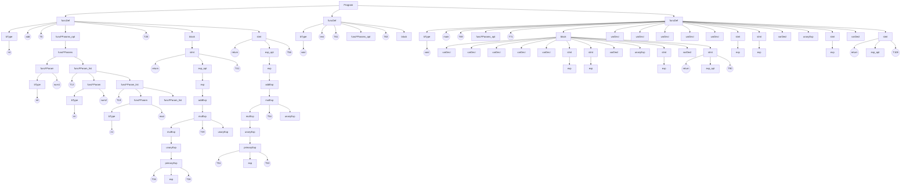

```mermaid
flowchart TD
    N0[Program]
    N1[funcDef]
    N0 --> N1
    N2[bType]
    N1 --> N2
    N3((int))
    N2 --> N3
    N4((add))
    N1 --> N4
    N5((T5))
    N1 --> N5
    N6[funcFParams_opt]
    N1 --> N6
    N7[funcFParams]
    N6 --> N7
    N8[funcFParam]
    N7 --> N8
    N9[bType]
    N8 --> N9
    N10((int))
    N9 --> N10
    N11((num1))
    N8 --> N11
    N12[funcFParam_list]
    N7 --> N12
    N13((T13))
    N12 --> N13
    N14[funcFParam]
    N12 --> N14
    N15[bType]
    N14 --> N15
    N16((int))
    N15 --> N16
    N17((num2))
    N14 --> N17
    N18[funcFParam_list]
    N12 --> N18
    N19((T19))
    N18 --> N19
    N20[funcFParam]
    N18 --> N20
    N21[bType]
    N20 --> N21
    N22((int))
    N21 --> N22
    N23((mod))
    N20 --> N23
    N24[funcFParam_list]
    N18 --> N24
    N25((T25))
    N1 --> N25
    N26[block]
    N1 --> N26
    N27[stmt]
    N26 --> N27
    N28((return))
    N27 --> N28
    N29[exp_opt]
    N27 --> N29
    N30[exp]
    N29 --> N30
    N31[addExp]
    N30 --> N31
    N32[mulExp]
    N31 --> N32
    N33[mulExp]
    N32 --> N33
    N34[unaryExp]
    N33 --> N34
    N35[primaryExp]
    N34 --> N35
    N36((T36))
    N35 --> N36
    N37[exp]
    N35 --> N37
    N38((T38))
    N35 --> N38
    N39((T39))
    N32 --> N39
    N40[unaryExp]
    N32 --> N40
    N41((T41))
    N27 --> N41
    N42[stmt]
    N1 --> N42
    N43((return))
    N42 --> N43
    N44[exp_opt]
    N42 --> N44
    N45[exp]
    N44 --> N45
    N46[addExp]
    N45 --> N46
    N47[mulExp]
    N46 --> N47
    N48[mulExp]
    N47 --> N48
    N49[unaryExp]
    N48 --> N49
    N50[primaryExp]
    N49 --> N50
    N51((T51))
    N50 --> N51
    N52[exp]
    N50 --> N52
    N53((T53))
    N50 --> N53
    N54((T54))
    N47 --> N54
    N55[unaryExp]
    N47 --> N55
    N56((T56))
    N42 --> N56
    N57[funcDef]
    N0 --> N57
    N58[bType]
    N57 --> N58
    N59((void))
    N58 --> N59
    N60((test))
    N57 --> N60
    N61((T61))
    N57 --> N61
    N62[funcFParams_opt]
    N57 --> N62
    N63((T63))
    N57 --> N63
    N64[block]
    N57 --> N64
    N65[funcDef]
    N0 --> N65
    N66[bType]
    N65 --> N66
    N67((void))
    N66 --> N67
    N68((main))
    N65 --> N68
    N69((T69))
    N65 --> N69
    N70[funcFParams_opt]
    N65 --> N70
    N71((T71))
    N65 --> N71
    N72[block]
    N65 --> N72
    N73[varDecl]
    N72 --> N73
    N74[varDecl]
    N72 --> N74
    N75[varDecl]
    N72 --> N75
    N76[varDecl]
    N72 --> N76
    N77[varDecl]
    N72 --> N77
    N78[stmt]
    N72 --> N78
    N79[exp]
    N78 --> N79
    N80[stmt]
    N72 --> N80
    N81[exp]
    N80 --> N81
    N82[varDecl]
    N72 --> N82
    N83[unaryExp]
    N72 --> N83
    N84[stmt]
    N72 --> N84
    N85[exp]
    N84 --> N85
    N86[varDecl]
    N72 --> N86
    N87[stmt]
    N72 --> N87
    N88((return))
    N87 --> N88
    N89[exp_opt]
    N87 --> N89
    N90((T90))
    N87 --> N90
    N91[varDecl]
    N65 --> N91
    N92[varDecl]
    N65 --> N92
    N93[varDecl]
    N65 --> N93
    N94[varDecl]
    N65 --> N94
    N95[varDecl]
    N65 --> N95
    N96[stmt]
    N65 --> N96
    N97[exp]
    N96 --> N97
    N98[stmt]
    N65 --> N98
    N99[exp]
    N98 --> N99
    N100[varDecl]
    N65 --> N100
    N101[unaryExp]
    N65 --> N101
    N102[stmt]
    N65 --> N102
    N103[exp]
    N102 --> N103
    N104[varDecl]
    N65 --> N104
    N105[stmt]
    N65 --> N105
    N106((return))
    N105 --> N106
    N107[exp_opt]
    N105 --> N107
    N108((T108))
    N105 --> N108
```
