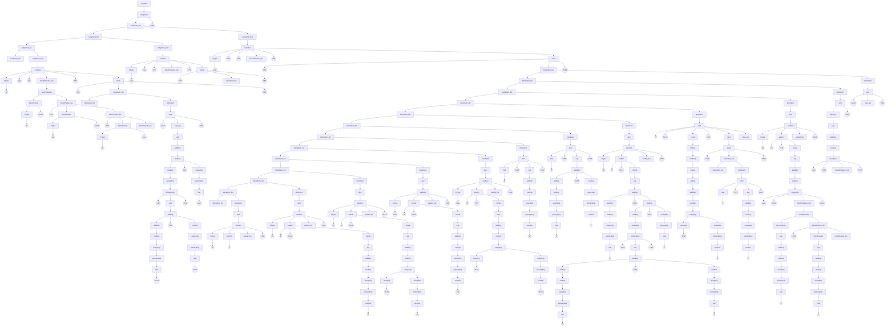

```mermaid
flowchart TD
    N0[Program]
    N1[compUnit]
    N0 --> N1
    N2[compUnit_list]
    N1 --> N2
    N3[compUnit_list]
    N2 --> N3
    N4[compUnit_list]
    N3 --> N4
    N5[compUnit_list]
    N4 --> N5
    N6[compUnit_item]
    N4 --> N6
    N7[funcDef]
    N6 --> N7
    N8[bType]
    N7 --> N8
    N9((int))
    N8 --> N9
    N10((add))
    N7 --> N10
    N11((T11))
    N7 --> N11
    N12[funcFParams_opt]
    N7 --> N12
    N13[funcFParams]
    N12 --> N13
    N14[funcFParam]
    N13 --> N14
    N15[bType]
    N14 --> N15
    N16((int))
    N15 --> N16
    N17((num1))
    N14 --> N17
    N18[funcFParam_list]
    N13 --> N18
    N19((T19))
    N18 --> N19
    N20[funcFParam]
    N18 --> N20
    N21[bType]
    N20 --> N21
    N22((int))
    N21 --> N22
    N23((num2))
    N20 --> N23
    N24[funcFParam_list]
    N18 --> N24
    N25((T25))
    N24 --> N25
    N26[funcFParam]
    N24 --> N26
    N27[bType]
    N26 --> N27
    N28((int))
    N27 --> N28
    N29((mod))
    N26 --> N29
    N30[funcFParam_list]
    N24 --> N30
    N31((T31))
    N7 --> N31
    N32[block]
    N7 --> N32
    N33((T33))
    N32 --> N33
    N34[blockItem_list]
    N32 --> N34
    N35[blockItem_list]
    N34 --> N35
    N36[blockItem]
    N34 --> N36
    N37[stmt]
    N36 --> N37
    N38((return))
    N37 --> N38
    N39[exp_opt]
    N37 --> N39
    N40[exp]
    N39 --> N40
    N41[addExp]
    N40 --> N41
    N42[mulExp]
    N41 --> N42
    N43[mulExp]
    N42 --> N43
    N44[unaryExp]
    N43 --> N44
    N45[primaryExp]
    N44 --> N45
    N46((T46))
    N45 --> N46
    N47[exp]
    N45 --> N47
    N48[addExp]
    N47 --> N48
    N49[addExp]
    N48 --> N49
    N50[mulExp]
    N49 --> N50
    N51[unaryExp]
    N50 --> N51
    N52[primaryExp]
    N51 --> N52
    N53[lVal]
    N52 --> N53
    N54((num1))
    N53 --> N54
    N55((T55))
    N48 --> N55
    N56[mulExp]
    N48 --> N56
    N57[unaryExp]
    N56 --> N57
    N58[primaryExp]
    N57 --> N58
    N59[lVal]
    N58 --> N59
    N60((num2))
    N59 --> N60
    N61((T61))
    N45 --> N61
    N62((T62))
    N42 --> N62
    N63[unaryExp]
    N42 --> N63
    N64[primaryExp]
    N63 --> N64
    N65[lVal]
    N64 --> N65
    N66((mod))
    N65 --> N66
    N67((T67))
    N37 --> N67
    N68((T68))
    N32 --> N68
    N69[compUnit_item]
    N3 --> N69
    N70[funcDef]
    N69 --> N70
    N71[bType]
    N70 --> N71
    N72((void))
    N71 --> N72
    N73((test))
    N70 --> N73
    N74((T74))
    N70 --> N74
    N75[funcFParams_opt]
    N70 --> N75
    N76((T76))
    N70 --> N76
    N77[block]
    N70 --> N77
    N78((T78))
    N77 --> N78
    N79[blockItem_list]
    N77 --> N79
    N80((T80))
    N77 --> N80
    N81[compUnit_item]
    N2 --> N81
    N82[funcDef]
    N81 --> N82
    N83[bType]
    N82 --> N83
    N84((void))
    N83 --> N84
    N85((main))
    N82 --> N85
    N86((T86))
    N82 --> N86
    N87[funcFParams_opt]
    N82 --> N87
    N88((T88))
    N82 --> N88
    N89[block]
    N82 --> N89
    N90((T90))
    N89 --> N90
    N91[blockItem_list]
    N89 --> N91
    N92[blockItem_list]
    N91 --> N92
    N93[blockItem_list]
    N92 --> N93
    N94[blockItem_list]
    N93 --> N94
    N95[blockItem_list]
    N94 --> N95
    N96[blockItem_list]
    N95 --> N96
    N97[blockItem_list]
    N96 --> N97
    N98[blockItem_list]
    N97 --> N98
    N99[blockItem_list]
    N98 --> N99
    N100[blockItem_list]
    N99 --> N100
    N101[blockItem_list]
    N100 --> N101
    N102[blockItem_list]
    N101 --> N102
    N103[blockItem_list]
    N102 --> N103
    N104[blockItem]
    N102 --> N104
    N105[decl]
    N104 --> N105
    N106[varDecl]
    N105 --> N106
    N107[bType]
    N106 --> N107
    N108((int))
    N107 --> N108
    N109[varDef]
    N106 --> N109
    N110((a))
    N109 --> N110
    N111[varDef_list]
    N106 --> N111
    N112((T112))
    N106 --> N112
    N113[blockItem]
    N101 --> N113
    N114[decl]
    N113 --> N114
    N115[varDecl]
    N114 --> N115
    N116[bType]
    N115 --> N116
    N117((int))
    N116 --> N117
    N118[varDef]
    N115 --> N118
    N119((b))
    N118 --> N119
    N120((T120))
    N118 --> N120
    N121[initVal]
    N118 --> N121
    N122[exp]
    N121 --> N122
    N123[addExp]
    N122 --> N123
    N124[mulExp]
    N123 --> N124
    N125[unaryExp]
    N124 --> N125
    N126[primaryExp]
    N125 --> N126
    N127[number]
    N126 --> N127
    N128((2))
    N127 --> N128
    N129[varDef_list]
    N115 --> N129
    N130((T130))
    N115 --> N130
    N131[blockItem]
    N100 --> N131
    N132[decl]
    N131 --> N132
    N133[varDecl]
    N132 --> N133
    N134[bType]
    N133 --> N134
    N135((int))
    N134 --> N135
    N136[varDef]
    N133 --> N136
    N137((c))
    N136 --> N137
    N138((T138))
    N136 --> N138
    N139[initVal]
    N136 --> N139
    N140[exp]
    N139 --> N140
    N141[addExp]
    N140 --> N141
    N142[mulExp]
    N141 --> N142
    N143[unaryExp]
    N142 --> N143
    N144[unaryOp]
    N143 --> N144
    N145((T145))
    N144 --> N145
    N146[unaryExp]
    N143 --> N146
    N147[primaryExp]
    N146 --> N147
    N148[number]
    N147 --> N148
    N149((32))
    N148 --> N149
    N150[varDef_list]
    N133 --> N150
    N151((T151))
    N133 --> N151
    N152[blockItem]
    N99 --> N152
    N153[decl]
    N152 --> N153
    N154[varDecl]
    N153 --> N154
    N155[bType]
    N154 --> N155
    N156((float))
    N155 --> N156
    N157[varDef]
    N154 --> N157
    N158((f1))
    N157 --> N158
    N159((T159))
    N157 --> N159
    N160[initVal]
    N157 --> N160
    N161[exp]
    N160 --> N161
    N162[addExp]
    N161 --> N162
    N163[mulExp]
    N162 --> N163
    N164[unaryExp]
    N163 --> N164
    N165[primaryExp]
    N164 --> N165
    N166[number]
    N165 --> N166
    N167((132))
    N166 --> N167
    N168[varDef_list]
    N154 --> N168
    N169((T169))
    N154 --> N169
    N170[blockItem]
    N98 --> N170
    N171[decl]
    N170 --> N171
    N172[varDecl]
    N171 --> N172
    N173[bType]
    N172 --> N173
    N174((float))
    N173 --> N174
    N175[varDef]
    N172 --> N175
    N176((f2))
    N175 --> N176
    N177((T177))
    N175 --> N177
    N178[initVal]
    N175 --> N178
    N179[exp]
    N178 --> N179
    N180[addExp]
    N179 --> N180
    N181[mulExp]
    N180 --> N181
    N182[unaryExp]
    N181 --> N182
    N183[unaryOp]
    N182 --> N183
    N184((T184))
    N183 --> N184
    N185[unaryExp]
    N182 --> N185
    N186[primaryExp]
    N185 --> N186
    N187[number]
    N186 --> N187
    N188((31233))
    N187 --> N188
    N189[varDef_list]
    N172 --> N189
    N190((T190))
    N172 --> N190
    N191[blockItem]
    N97 --> N191
    N192[stmt]
    N191 --> N192
    N193[lVal]
    N192 --> N193
    N194((a))
    N193 --> N194
    N195((T195))
    N192 --> N195
    N196[exp]
    N192 --> N196
    N197[addExp]
    N196 --> N197
    N198[mulExp]
    N197 --> N198
    N199[unaryExp]
    N198 --> N199
    N200[primaryExp]
    N199 --> N200
    N201[number]
    N200 --> N201
    N202((32))
    N201 --> N202
    N203((T203))
    N192 --> N203
    N204[blockItem]
    N96 --> N204
    N205[stmt]
    N204 --> N205
    N206[lVal]
    N205 --> N206
    N207((b))
    N206 --> N207
    N208((T208))
    N205 --> N208
    N209[exp]
    N205 --> N209
    N210[addExp]
    N209 --> N210
    N211[addExp]
    N210 --> N211
    N212[mulExp]
    N211 --> N212
    N213[unaryExp]
    N212 --> N213
    N214[primaryExp]
    N213 --> N214
    N215[lVal]
    N214 --> N215
    N216((a))
    N215 --> N216
    N217((T217))
    N210 --> N217
    N218[mulExp]
    N210 --> N218
    N219[unaryExp]
    N218 --> N219
    N220[primaryExp]
    N219 --> N220
    N221[number]
    N220 --> N221
    N222((1))
    N221 --> N222
    N223((T223))
    N205 --> N223
    N224[blockItem]
    N95 --> N224
    N225[decl]
    N224 --> N225
    N226[varDecl]
    N225 --> N226
    N227[bType]
    N226 --> N227
    N228((int))
    N227 --> N228
    N229[varDef]
    N226 --> N229
    N230((g))
    N229 --> N230
    N231((T231))
    N229 --> N231
    N232[initVal]
    N229 --> N232
    N233[exp]
    N232 --> N233
    N234[addExp]
    N233 --> N234
    N235[addExp]
    N234 --> N235
    N236[mulExp]
    N235 --> N236
    N237[unaryExp]
    N236 --> N237
    N238[primaryExp]
    N237 --> N238
    N239[lVal]
    N238 --> N239
    N240((b))
    N239 --> N240
    N241((T241))
    N234 --> N241
    N242[mulExp]
    N234 --> N242
    N243[mulExp]
    N242 --> N243
    N244[unaryExp]
    N243 --> N244
    N245[primaryExp]
    N244 --> N245
    N246((T246))
    N245 --> N246
    N247[exp]
    N245 --> N247
    N248[addExp]
    N247 --> N248
    N249[addExp]
    N248 --> N249
    N250[mulExp]
    N249 --> N250
    N251[unaryExp]
    N250 --> N251
    N252[primaryExp]
    N251 --> N252
    N253[lVal]
    N252 --> N253
    N254((a))
    N253 --> N254
    N255((T255))
    N248 --> N255
    N256[mulExp]
    N248 --> N256
    N257[unaryExp]
    N256 --> N257
    N258[primaryExp]
    N257 --> N258
    N259[lVal]
    N258 --> N259
    N260((c))
    N259 --> N260
    N261((T261))
    N245 --> N261
    N262((T262))
    N242 --> N262
    N263[unaryExp]
    N242 --> N263
    N264[primaryExp]
    N263 --> N264
    N265[lVal]
    N264 --> N265
    N266((a))
    N265 --> N266
    N267[varDef_list]
    N226 --> N267
    N268((T268))
    N226 --> N268
    N269[blockItem]
    N94 --> N269
    N270[stmt]
    N269 --> N270
    N271((if))
    N270 --> N271
    N272((T272))
    N270 --> N272
    N273[cond]
    N270 --> N273
    N274[lOrExp]
    N273 --> N274
    N275[lAndExp]
    N274 --> N275
    N276[eqExp]
    N275 --> N276
    N277[relExp]
    N276 --> N277
    N278[addExp]
    N277 --> N278
    N279[mulExp]
    N278 --> N279
    N280[unaryExp]
    N279 --> N280
    N281[unaryOp]
    N280 --> N281
    N282((T282))
    N281 --> N282
    N283[unaryExp]
    N280 --> N283
    N284[primaryExp]
    N283 --> N284
    N285[number]
    N284 --> N285
    N286((0))
    N285 --> N286
    N287((T287))
    N270 --> N287
    N288[stmt]
    N270 --> N288
    N289[block]
    N288 --> N289
    N290((T290))
    N289 --> N290
    N291[blockItem_list]
    N289 --> N291
    N292[blockItem_list]
    N291 --> N292
    N293[blockItem]
    N291 --> N293
    N294[stmt]
    N293 --> N294
    N295[lVal]
    N294 --> N295
    N296((a))
    N295 --> N296
    N297((T297))
    N294 --> N297
    N298[exp]
    N294 --> N298
    N299[addExp]
    N298 --> N299
    N300[mulExp]
    N299 --> N300
    N301[unaryExp]
    N300 --> N301
    N302[primaryExp]
    N301 --> N302
    N303[number]
    N302 --> N303
    N304((2))
    N303 --> N304
    N305((T305))
    N294 --> N305
    N306((T306))
    N289 --> N306
    N307[else_opt]
    N270 --> N307
    N308[blockItem]
    N93 --> N308
    N309[decl]
    N308 --> N309
    N310[varDecl]
    N309 --> N310
    N311[bType]
    N310 --> N311
    N312((int))
    N311 --> N312
    N313[varDef]
    N310 --> N313
    N314((ret))
    N313 --> N314
    N315((T315))
    N313 --> N315
    N316[initVal]
    N313 --> N316
    N317[exp]
    N316 --> N317
    N318[addExp]
    N317 --> N318
    N319[mulExp]
    N318 --> N319
    N320[unaryExp]
    N319 --> N320
    N321((add))
    N320 --> N321
    N322((T322))
    N320 --> N322
    N323[funcRParams_opt]
    N320 --> N323
    N324[funcRParams]
    N323 --> N324
    N325[funcRParam]
    N324 --> N325
    N326[exp]
    N325 --> N326
    N327[addExp]
    N326 --> N327
    N328[mulExp]
    N327 --> N328
    N329[unaryExp]
    N328 --> N329
    N330[primaryExp]
    N329 --> N330
    N331[lVal]
    N330 --> N331
    N332((b))
    N331 --> N332
    N333[funcRParam_list]
    N324 --> N333
    N334((T334))
    N333 --> N334
    N335[funcRParam]
    N333 --> N335
    N336[exp]
    N335 --> N336
    N337[addExp]
    N336 --> N337
    N338[mulExp]
    N337 --> N338
    N339[unaryExp]
    N338 --> N339
    N340[primaryExp]
    N339 --> N340
    N341[lVal]
    N340 --> N341
    N342((c))
    N341 --> N342
    N343[funcRParam_list]
    N333 --> N343
    N344((T344))
    N320 --> N344
    N345[varDef_list]
    N310 --> N345
    N346((T346))
    N310 --> N346
    N347[blockItem]
    N92 --> N347
    N348[stmt]
    N347 --> N348
    N349[exp_opt]
    N348 --> N349
    N350[exp]
    N349 --> N350
    N351[addExp]
    N350 --> N351
    N352[mulExp]
    N351 --> N352
    N353[unaryExp]
    N352 --> N353
    N354((test))
    N353 --> N354
    N355((T355))
    N353 --> N355
    N356[funcRParams_opt]
    N353 --> N356
    N357((T357))
    N353 --> N357
    N358((T358))
    N348 --> N358
    N359[blockItem]
    N91 --> N359
    N360[stmt]
    N359 --> N360
    N361((return))
    N360 --> N361
    N362[exp_opt]
    N360 --> N362
    N363((T363))
    N360 --> N363
    N364((T364))
    N89 --> N364
    N365((T365))
    N1 --> N365
```
