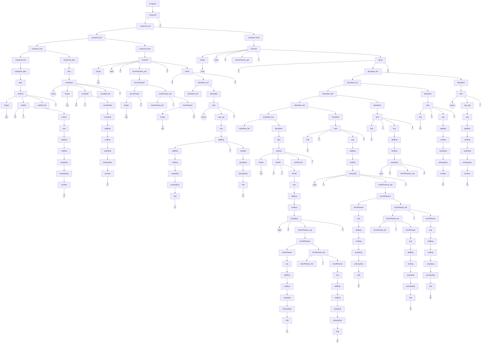

```mermaid
flowchart TD
    N0[Program]
    N1[compUnit]
    N0 --> N1
    N2[compUnit_list]
    N1 --> N2
    N3[compUnit_list]
    N2 --> N3
    N4[compUnit_list]
    N3 --> N4
    N5[compUnit_list]
    N4 --> N5
    N6[compUnit_item]
    N5 --> N6
    N7[decl]
    N6 --> N7
    N8[varDecl]
    N7 --> N8
    N9[bType]
    N8 --> N9
    N10(("int"))
    N9 --> N10
    N11[varDef]
    N8 --> N11
    N12(("a"))
    N11 --> N12
    N13(("="))
    N11 --> N13
    N14[initVal]
    N11 --> N14
    N15[exp]
    N14 --> N15
    N16[addExp]
    N15 --> N16
    N17[mulExp]
    N16 --> N17
    N18[unaryExp]
    N17 --> N18
    N19[primaryExp]
    N18 --> N19
    N20[number]
    N19 --> N20
    N21(("1"))
    N20 --> N21
    N22[varDef_list]
    N8 --> N22
    N23((";"))
    N8 --> N23
    N24[compUnit_item]
    N4 --> N24
    N25[decl]
    N24 --> N25
    N26[constDecl]
    N25 --> N26
    N27(("const"))
    N26 --> N27
    N28[bType]
    N26 --> N28
    N29(("int"))
    N28 --> N29
    N30[constDef]
    N26 --> N30
    N31(("b"))
    N30 --> N31
    N32(("="))
    N30 --> N32
    N33[constInitVal]
    N30 --> N33
    N34[constExp]
    N33 --> N34
    N35[addExp]
    N34 --> N35
    N36[mulExp]
    N35 --> N36
    N37[unaryExp]
    N36 --> N37
    N38[primaryExp]
    N37 --> N38
    N39[number]
    N38 --> N39
    N40(("2"))
    N39 --> N40
    N41[constDef_list]
    N26 --> N41
    N42((";"))
    N26 --> N42
    N43[compUnit_item]
    N3 --> N43
    N44[funcDef]
    N43 --> N44
    N45[bType]
    N44 --> N45
    N46(("int"))
    N45 --> N46
    N47(("add"))
    N44 --> N47
    N48(("("))
    N44 --> N48
    N49[funcFParams_opt]
    N44 --> N49
    N50[funcFParams]
    N49 --> N50
    N51[funcFParam]
    N50 --> N51
    N52[bType]
    N51 --> N52
    N53(("int"))
    N52 --> N53
    N54(("c"))
    N51 --> N54
    N55[funcFParam_list]
    N50 --> N55
    N56[funcFParam_list]
    N55 --> N56
    N57((","))
    N55 --> N57
    N58[funcFParam]
    N55 --> N58
    N59[bType]
    N58 --> N59
    N60(("int"))
    N59 --> N60
    N61(("d"))
    N58 --> N61
    N62((")"))
    N44 --> N62
    N63[block]
    N44 --> N63
    N64(("{"))
    N63 --> N64
    N65[blockItem_list]
    N63 --> N65
    N66[blockItem_list]
    N65 --> N66
    N67[blockItem]
    N65 --> N67
    N68[stmt]
    N67 --> N68
    N69(("return"))
    N68 --> N69
    N70[exp_opt]
    N68 --> N70
    N71[exp]
    N70 --> N71
    N72[addExp]
    N71 --> N72
    N73[addExp]
    N72 --> N73
    N74[mulExp]
    N73 --> N74
    N75[unaryExp]
    N74 --> N75
    N76[primaryExp]
    N75 --> N76
    N77[lVal]
    N76 --> N77
    N78(("a"))
    N77 --> N78
    N79(("+"))
    N72 --> N79
    N80[mulExp]
    N72 --> N80
    N81[unaryExp]
    N80 --> N81
    N82[primaryExp]
    N81 --> N82
    N83[lVal]
    N82 --> N83
    N84(("b"))
    N83 --> N84
    N85((";"))
    N68 --> N85
    N86(("}"))
    N63 --> N86
    N87[compUnit_item]
    N2 --> N87
    N88[funcDef]
    N87 --> N88
    N89[bType]
    N88 --> N89
    N90(("void"))
    N89 --> N90
    N91(("main"))
    N88 --> N91
    N92(("("))
    N88 --> N92
    N93[funcFParams_opt]
    N88 --> N93
    N94((")"))
    N88 --> N94
    N95[block]
    N88 --> N95
    N96(("{"))
    N95 --> N96
    N97[blockItem_list]
    N95 --> N97
    N98[blockItem_list]
    N97 --> N98
    N99[blockItem_list]
    N98 --> N99
    N100[blockItem_list]
    N99 --> N100
    N101[blockItem_list]
    N100 --> N101
    N102[blockItem_list]
    N101 --> N102
    N103[blockItem]
    N101 --> N103
    N104[decl]
    N103 --> N104
    N105[varDecl]
    N104 --> N105
    N106[bType]
    N105 --> N106
    N107(("int"))
    N106 --> N107
    N108[varDef]
    N105 --> N108
    N109(("x"))
    N108 --> N109
    N110(("="))
    N108 --> N110
    N111[initVal]
    N108 --> N111
    N112[exp]
    N111 --> N112
    N113[addExp]
    N112 --> N113
    N114[mulExp]
    N113 --> N114
    N115[unaryExp]
    N114 --> N115
    N116(("add"))
    N115 --> N116
    N117(("("))
    N115 --> N117
    N118[funcRParams_opt]
    N115 --> N118
    N119[funcRParams]
    N118 --> N119
    N120[funcRParam]
    N119 --> N120
    N121[exp]
    N120 --> N121
    N122[addExp]
    N121 --> N122
    N123[mulExp]
    N122 --> N123
    N124[unaryExp]
    N123 --> N124
    N125[primaryExp]
    N124 --> N125
    N126[lVal]
    N125 --> N126
    N127(("a"))
    N126 --> N127
    N128[funcRParam_list]
    N119 --> N128
    N129[funcRParam_list]
    N128 --> N129
    N130((","))
    N128 --> N130
    N131[funcRParam]
    N128 --> N131
    N132[exp]
    N131 --> N132
    N133[addExp]
    N132 --> N133
    N134[mulExp]
    N133 --> N134
    N135[unaryExp]
    N134 --> N135
    N136[primaryExp]
    N135 --> N136
    N137[lVal]
    N136 --> N137
    N138(("b"))
    N137 --> N138
    N139((")"))
    N115 --> N139
    N140[varDef_list]
    N105 --> N140
    N141((";"))
    N105 --> N141
    N142[blockItem]
    N100 --> N142
    N143[stmt]
    N142 --> N143
    N144[lVal]
    N143 --> N144
    N145(("x"))
    N144 --> N145
    N146(("="))
    N143 --> N146
    N147[exp]
    N143 --> N147
    N148[addExp]
    N147 --> N148
    N149[mulExp]
    N148 --> N149
    N150[unaryExp]
    N149 --> N150
    N151(("add"))
    N150 --> N151
    N152(("("))
    N150 --> N152
    N153[funcRParams_opt]
    N150 --> N153
    N154[funcRParams]
    N153 --> N154
    N155[funcRParam]
    N154 --> N155
    N156[exp]
    N155 --> N156
    N157[addExp]
    N156 --> N157
    N158[mulExp]
    N157 --> N158
    N159[unaryExp]
    N158 --> N159
    N160[primaryExp]
    N159 --> N160
    N161[lVal]
    N160 --> N161
    N162(("a"))
    N161 --> N162
    N163[funcRParam_list]
    N154 --> N163
    N164[funcRParam_list]
    N163 --> N164
    N165[funcRParam_list]
    N164 --> N165
    N166((","))
    N164 --> N166
    N167[funcRParam]
    N164 --> N167
    N168[exp]
    N167 --> N168
    N169[addExp]
    N168 --> N169
    N170[mulExp]
    N169 --> N170
    N171[unaryExp]
    N170 --> N171
    N172[primaryExp]
    N171 --> N172
    N173[lVal]
    N172 --> N173
    N174(("b"))
    N173 --> N174
    N175((","))
    N163 --> N175
    N176[funcRParam]
    N163 --> N176
    N177[exp]
    N176 --> N177
    N178[addExp]
    N177 --> N178
    N179[mulExp]
    N178 --> N179
    N180[unaryExp]
    N179 --> N180
    N181[primaryExp]
    N180 --> N181
    N182[lVal]
    N181 --> N182
    N183(("b"))
    N182 --> N183
    N184((")"))
    N150 --> N184
    N185((";"))
    N143 --> N185
    N186[blockItem]
    N99 --> N186
    N187[stmt]
    N186 --> N187
    N188[lVal]
    N187 --> N188
    N189(("x"))
    N188 --> N189
    N190(("="))
    N187 --> N190
    N191[exp]
    N187 --> N191
    N192[addExp]
    N191 --> N192
    N193[mulExp]
    N192 --> N193
    N194[unaryExp]
    N193 --> N194
    N195(("sub"))
    N194 --> N195
    N196(("("))
    N194 --> N196
    N197[funcRParams_opt]
    N194 --> N197
    N198((")"))
    N194 --> N198
    N199((";"))
    N187 --> N199
    N200[blockItem]
    N98 --> N200
    N201[stmt]
    N200 --> N201
    N202[lVal]
    N201 --> N202
    N203(("b"))
    N202 --> N203
    N204(("="))
    N201 --> N204
    N205[exp]
    N201 --> N205
    N206[addExp]
    N205 --> N206
    N207[mulExp]
    N206 --> N207
    N208[unaryExp]
    N207 --> N208
    N209[primaryExp]
    N208 --> N209
    N210[number]
    N209 --> N210
    N211(("5"))
    N210 --> N211
    N212((";"))
    N201 --> N212
    N213[blockItem]
    N97 --> N213
    N214[stmt]
    N213 --> N214
    N215(("return"))
    N214 --> N215
    N216[exp_opt]
    N214 --> N216
    N217[exp]
    N216 --> N217
    N218[addExp]
    N217 --> N218
    N219[mulExp]
    N218 --> N219
    N220[unaryExp]
    N219 --> N220
    N221[primaryExp]
    N220 --> N221
    N222[number]
    N221 --> N222
    N223(("0"))
    N222 --> N223
    N224((";"))
    N214 --> N224
    N225(("}"))
    N95 --> N225
    N226(("}"))
    N1 --> N226
```
