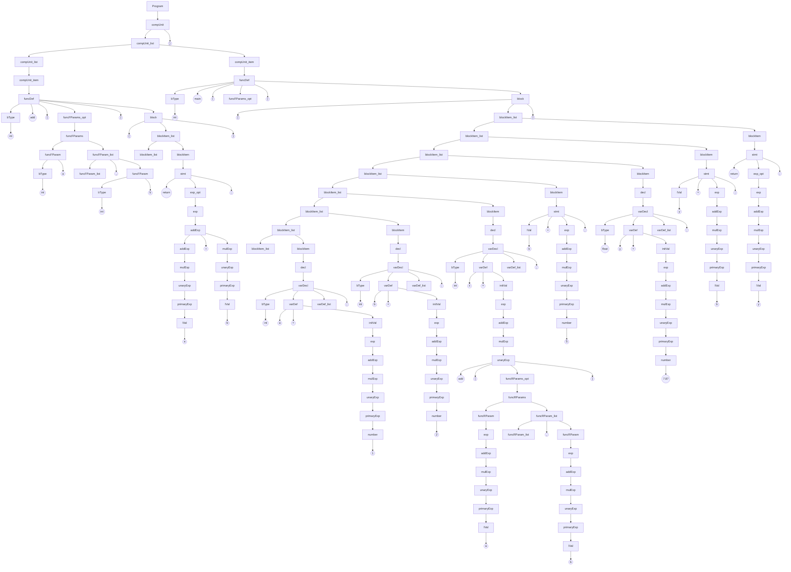

```mermaid
flowchart TD
    N0[Program]
    N1[compUnit]
    N0 --> N1
    N2[compUnit_list]
    N1 --> N2
    N3[compUnit_list]
    N2 --> N3
    N4[compUnit_item]
    N3 --> N4
    N5[funcDef]
    N4 --> N5
    N6[bType]
    N5 --> N6
    N7(("int"))
    N6 --> N7
    N8(("add"))
    N5 --> N8
    N9(("("))
    N5 --> N9
    N10[funcFParams_opt]
    N5 --> N10
    N11[funcFParams]
    N10 --> N11
    N12[funcFParam]
    N11 --> N12
    N13[bType]
    N12 --> N13
    N14(("int"))
    N13 --> N14
    N15(("a"))
    N12 --> N15
    N16[funcFParam_list]
    N11 --> N16
    N17[funcFParam_list]
    N16 --> N17
    N18((","))
    N16 --> N18
    N19[funcFParam]
    N16 --> N19
    N20[bType]
    N19 --> N20
    N21(("int"))
    N20 --> N21
    N22(("b"))
    N19 --> N22
    N23((")"))
    N5 --> N23
    N24[block]
    N5 --> N24
    N25(("{"))
    N24 --> N25
    N26[blockItem_list]
    N24 --> N26
    N27[blockItem_list]
    N26 --> N27
    N28[blockItem]
    N26 --> N28
    N29[stmt]
    N28 --> N29
    N30(("return"))
    N29 --> N30
    N31[exp_opt]
    N29 --> N31
    N32[exp]
    N31 --> N32
    N33[addExp]
    N32 --> N33
    N34[addExp]
    N33 --> N34
    N35[mulExp]
    N34 --> N35
    N36[unaryExp]
    N35 --> N36
    N37[primaryExp]
    N36 --> N37
    N38[lVal]
    N37 --> N38
    N39(("a"))
    N38 --> N39
    N40(("+"))
    N33 --> N40
    N41[mulExp]
    N33 --> N41
    N42[unaryExp]
    N41 --> N42
    N43[primaryExp]
    N42 --> N43
    N44[lVal]
    N43 --> N44
    N45(("b"))
    N44 --> N45
    N46((";"))
    N29 --> N46
    N47(("}"))
    N24 --> N47
    N48[compUnit_item]
    N2 --> N48
    N49[funcDef]
    N48 --> N49
    N50[bType]
    N49 --> N50
    N51(("int"))
    N50 --> N51
    N52(("main"))
    N49 --> N52
    N53(("("))
    N49 --> N53
    N54[funcFParams_opt]
    N49 --> N54
    N55((")"))
    N49 --> N55
    N56[block]
    N49 --> N56
    N57(("{"))
    N56 --> N57
    N58[blockItem_list]
    N56 --> N58
    N59[blockItem_list]
    N58 --> N59
    N60[blockItem_list]
    N59 --> N60
    N61[blockItem_list]
    N60 --> N61
    N62[blockItem_list]
    N61 --> N62
    N63[blockItem_list]
    N62 --> N63
    N64[blockItem_list]
    N63 --> N64
    N65[blockItem_list]
    N64 --> N65
    N66[blockItem]
    N64 --> N66
    N67[decl]
    N66 --> N67
    N68[varDecl]
    N67 --> N68
    N69[bType]
    N68 --> N69
    N70(("int"))
    N69 --> N70
    N71[varDef]
    N68 --> N71
    N72(("a"))
    N71 --> N72
    N73(("="))
    N71 --> N73
    N74[initVal]
    N71 --> N74
    N75[exp]
    N74 --> N75
    N76[addExp]
    N75 --> N76
    N77[mulExp]
    N76 --> N77
    N78[unaryExp]
    N77 --> N78
    N79[primaryExp]
    N78 --> N79
    N80[number]
    N79 --> N80
    N81(("1"))
    N80 --> N81
    N82[varDef_list]
    N68 --> N82
    N83((";"))
    N68 --> N83
    N84[blockItem]
    N63 --> N84
    N85[decl]
    N84 --> N85
    N86[varDecl]
    N85 --> N86
    N87[bType]
    N86 --> N87
    N88(("int"))
    N87 --> N88
    N89[varDef]
    N86 --> N89
    N90(("b"))
    N89 --> N90
    N91(("="))
    N89 --> N91
    N92[initVal]
    N89 --> N92
    N93[exp]
    N92 --> N93
    N94[addExp]
    N93 --> N94
    N95[mulExp]
    N94 --> N95
    N96[unaryExp]
    N95 --> N96
    N97[primaryExp]
    N96 --> N97
    N98[number]
    N97 --> N98
    N99(("2"))
    N98 --> N99
    N100[varDef_list]
    N86 --> N100
    N101((";"))
    N86 --> N101
    N102[blockItem]
    N62 --> N102
    N103[decl]
    N102 --> N103
    N104[varDecl]
    N103 --> N104
    N105[bType]
    N104 --> N105
    N106(("int"))
    N105 --> N106
    N107[varDef]
    N104 --> N107
    N108(("x"))
    N107 --> N108
    N109(("="))
    N107 --> N109
    N110[initVal]
    N107 --> N110
    N111[exp]
    N110 --> N111
    N112[addExp]
    N111 --> N112
    N113[mulExp]
    N112 --> N113
    N114[unaryExp]
    N113 --> N114
    N115(("add"))
    N114 --> N115
    N116(("("))
    N114 --> N116
    N117[funcRParams_opt]
    N114 --> N117
    N118[funcRParams]
    N117 --> N118
    N119[funcRParam]
    N118 --> N119
    N120[exp]
    N119 --> N120
    N121[addExp]
    N120 --> N121
    N122[mulExp]
    N121 --> N122
    N123[unaryExp]
    N122 --> N123
    N124[primaryExp]
    N123 --> N124
    N125[lVal]
    N124 --> N125
    N126(("a"))
    N125 --> N126
    N127[funcRParam_list]
    N118 --> N127
    N128[funcRParam_list]
    N127 --> N128
    N129((","))
    N127 --> N129
    N130[funcRParam]
    N127 --> N130
    N131[exp]
    N130 --> N131
    N132[addExp]
    N131 --> N132
    N133[mulExp]
    N132 --> N133
    N134[unaryExp]
    N133 --> N134
    N135[primaryExp]
    N134 --> N135
    N136[lVal]
    N135 --> N136
    N137(("b"))
    N136 --> N137
    N138((")"))
    N114 --> N138
    N139[varDef_list]
    N104 --> N139
    N140((";"))
    N104 --> N140
    N141[blockItem]
    N61 --> N141
    N142[stmt]
    N141 --> N142
    N143[lVal]
    N142 --> N143
    N144(("b"))
    N143 --> N144
    N145(("="))
    N142 --> N145
    N146[exp]
    N142 --> N146
    N147[addExp]
    N146 --> N147
    N148[mulExp]
    N147 --> N148
    N149[unaryExp]
    N148 --> N149
    N150[primaryExp]
    N149 --> N150
    N151[number]
    N150 --> N151
    N152(("5"))
    N151 --> N152
    N153((";"))
    N142 --> N153
    N154[blockItem]
    N60 --> N154
    N155[decl]
    N154 --> N155
    N156[varDecl]
    N155 --> N156
    N157[bType]
    N156 --> N157
    N158(("float"))
    N157 --> N158
    N159[varDef]
    N156 --> N159
    N160(("y"))
    N159 --> N160
    N161(("="))
    N159 --> N161
    N162[initVal]
    N159 --> N162
    N163[exp]
    N162 --> N163
    N164[addExp]
    N163 --> N164
    N165[mulExp]
    N164 --> N165
    N166[unaryExp]
    N165 --> N166
    N167[primaryExp]
    N166 --> N167
    N168[number]
    N167 --> N168
    N169(("7.87"))
    N168 --> N169
    N170[varDef_list]
    N156 --> N170
    N171((";"))
    N156 --> N171
    N172[blockItem]
    N59 --> N172
    N173[stmt]
    N172 --> N173
    N174[lVal]
    N173 --> N174
    N175(("y"))
    N174 --> N175
    N176(("="))
    N173 --> N176
    N177[exp]
    N173 --> N177
    N178[addExp]
    N177 --> N178
    N179[mulExp]
    N178 --> N179
    N180[unaryExp]
    N179 --> N180
    N181[primaryExp]
    N180 --> N181
    N182[lVal]
    N181 --> N182
    N183(("b"))
    N182 --> N183
    N184((";"))
    N173 --> N184
    N185[blockItem]
    N58 --> N185
    N186[stmt]
    N185 --> N186
    N187(("return"))
    N186 --> N187
    N188[exp_opt]
    N186 --> N188
    N189[exp]
    N188 --> N189
    N190[addExp]
    N189 --> N190
    N191[mulExp]
    N190 --> N191
    N192[unaryExp]
    N191 --> N192
    N193[primaryExp]
    N192 --> N193
    N194[lVal]
    N193 --> N194
    N195(("y"))
    N194 --> N195
    N196((";"))
    N186 --> N196
    N197(("}"))
    N56 --> N197
    N198(("}"))
    N1 --> N198
```
