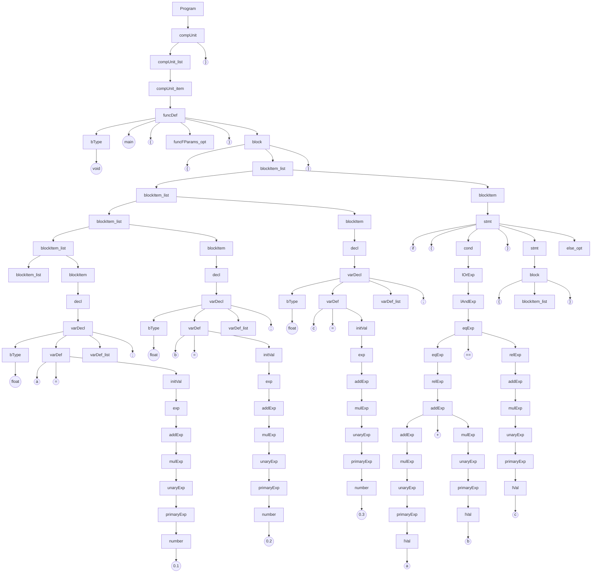

```mermaid
flowchart TD
    N0[Program]
    N1[compUnit]
    N0 --> N1
    N2[compUnit_list]
    N1 --> N2
    N3[compUnit_item]
    N2 --> N3
    N4[funcDef]
    N3 --> N4
    N5[bType]
    N4 --> N5
    N6(("void"))
    N5 --> N6
    N7(("main"))
    N4 --> N7
    N8(("("))
    N4 --> N8
    N9[funcFParams_opt]
    N4 --> N9
    N10((")"))
    N4 --> N10
    N11[block]
    N4 --> N11
    N12(("{"))
    N11 --> N12
    N13[blockItem_list]
    N11 --> N13
    N14[blockItem_list]
    N13 --> N14
    N15[blockItem_list]
    N14 --> N15
    N16[blockItem_list]
    N15 --> N16
    N17[blockItem_list]
    N16 --> N17
    N18[blockItem]
    N16 --> N18
    N19[decl]
    N18 --> N19
    N20[varDecl]
    N19 --> N20
    N21[bType]
    N20 --> N21
    N22(("float"))
    N21 --> N22
    N23[varDef]
    N20 --> N23
    N24(("a"))
    N23 --> N24
    N25(("="))
    N23 --> N25
    N26[initVal]
    N23 --> N26
    N27[exp]
    N26 --> N27
    N28[addExp]
    N27 --> N28
    N29[mulExp]
    N28 --> N29
    N30[unaryExp]
    N29 --> N30
    N31[primaryExp]
    N30 --> N31
    N32[number]
    N31 --> N32
    N33(("0.1"))
    N32 --> N33
    N34[varDef_list]
    N20 --> N34
    N35((";"))
    N20 --> N35
    N36[blockItem]
    N15 --> N36
    N37[decl]
    N36 --> N37
    N38[varDecl]
    N37 --> N38
    N39[bType]
    N38 --> N39
    N40(("float"))
    N39 --> N40
    N41[varDef]
    N38 --> N41
    N42(("b"))
    N41 --> N42
    N43(("="))
    N41 --> N43
    N44[initVal]
    N41 --> N44
    N45[exp]
    N44 --> N45
    N46[addExp]
    N45 --> N46
    N47[mulExp]
    N46 --> N47
    N48[unaryExp]
    N47 --> N48
    N49[primaryExp]
    N48 --> N49
    N50[number]
    N49 --> N50
    N51(("0.2"))
    N50 --> N51
    N52[varDef_list]
    N38 --> N52
    N53((";"))
    N38 --> N53
    N54[blockItem]
    N14 --> N54
    N55[decl]
    N54 --> N55
    N56[varDecl]
    N55 --> N56
    N57[bType]
    N56 --> N57
    N58(("float"))
    N57 --> N58
    N59[varDef]
    N56 --> N59
    N60(("c"))
    N59 --> N60
    N61(("="))
    N59 --> N61
    N62[initVal]
    N59 --> N62
    N63[exp]
    N62 --> N63
    N64[addExp]
    N63 --> N64
    N65[mulExp]
    N64 --> N65
    N66[unaryExp]
    N65 --> N66
    N67[primaryExp]
    N66 --> N67
    N68[number]
    N67 --> N68
    N69(("0.3"))
    N68 --> N69
    N70[varDef_list]
    N56 --> N70
    N71((";"))
    N56 --> N71
    N72[blockItem]
    N13 --> N72
    N73[stmt]
    N72 --> N73
    N74(("if"))
    N73 --> N74
    N75(("("))
    N73 --> N75
    N76[cond]
    N73 --> N76
    N77[lOrExp]
    N76 --> N77
    N78[lAndExp]
    N77 --> N78
    N79[eqExp]
    N78 --> N79
    N80[eqExp]
    N79 --> N80
    N81[relExp]
    N80 --> N81
    N82[addExp]
    N81 --> N82
    N83[addExp]
    N82 --> N83
    N84[mulExp]
    N83 --> N84
    N85[unaryExp]
    N84 --> N85
    N86[primaryExp]
    N85 --> N86
    N87[lVal]
    N86 --> N87
    N88(("a"))
    N87 --> N88
    N89(("+"))
    N82 --> N89
    N90[mulExp]
    N82 --> N90
    N91[unaryExp]
    N90 --> N91
    N92[primaryExp]
    N91 --> N92
    N93[lVal]
    N92 --> N93
    N94(("b"))
    N93 --> N94
    N95(("=="))
    N79 --> N95
    N96[relExp]
    N79 --> N96
    N97[addExp]
    N96 --> N97
    N98[mulExp]
    N97 --> N98
    N99[unaryExp]
    N98 --> N99
    N100[primaryExp]
    N99 --> N100
    N101[lVal]
    N100 --> N101
    N102(("c"))
    N101 --> N102
    N103((")"))
    N73 --> N103
    N104[stmt]
    N73 --> N104
    N105[block]
    N104 --> N105
    N106(("{"))
    N105 --> N106
    N107[blockItem_list]
    N105 --> N107
    N108(("}"))
    N105 --> N108
    N109[else_opt]
    N73 --> N109
    N110(("}"))
    N11 --> N110
    N111(("}"))
    N1 --> N111
```
