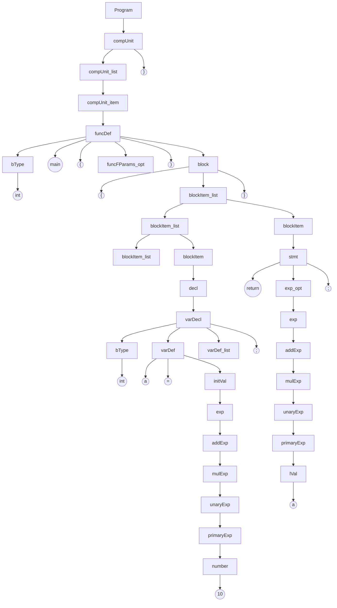

```mermaid
flowchart TD
    N0[Program]
    N1[compUnit]
    N0 --> N1
    N2[compUnit_list]
    N1 --> N2
    N3[compUnit_item]
    N2 --> N3
    N4[funcDef]
    N3 --> N4
    N5[bType]
    N4 --> N5
    N6(("int"))
    N5 --> N6
    N7(("main"))
    N4 --> N7
    N8(("("))
    N4 --> N8
    N9[funcFParams_opt]
    N4 --> N9
    N10((")"))
    N4 --> N10
    N11[block]
    N4 --> N11
    N12(("{"))
    N11 --> N12
    N13[blockItem_list]
    N11 --> N13
    N14[blockItem_list]
    N13 --> N14
    N15[blockItem_list]
    N14 --> N15
    N16[blockItem]
    N14 --> N16
    N17[decl]
    N16 --> N17
    N18[varDecl]
    N17 --> N18
    N19[bType]
    N18 --> N19
    N20(("int"))
    N19 --> N20
    N21[varDef]
    N18 --> N21
    N22(("a"))
    N21 --> N22
    N23(("="))
    N21 --> N23
    N24[initVal]
    N21 --> N24
    N25[exp]
    N24 --> N25
    N26[addExp]
    N25 --> N26
    N27[mulExp]
    N26 --> N27
    N28[unaryExp]
    N27 --> N28
    N29[primaryExp]
    N28 --> N29
    N30[number]
    N29 --> N30
    N31(("10"))
    N30 --> N31
    N32[varDef_list]
    N18 --> N32
    N33((";"))
    N18 --> N33
    N34[blockItem]
    N13 --> N34
    N35[stmt]
    N34 --> N35
    N36(("return"))
    N35 --> N36
    N37[exp_opt]
    N35 --> N37
    N38[exp]
    N37 --> N38
    N39[addExp]
    N38 --> N39
    N40[mulExp]
    N39 --> N40
    N41[unaryExp]
    N40 --> N41
    N42[primaryExp]
    N41 --> N42
    N43[lVal]
    N42 --> N43
    N44(("a"))
    N43 --> N44
    N45((";"))
    N35 --> N45
    N46(("}"))
    N11 --> N46
    N47(("}"))
    N1 --> N47
```
