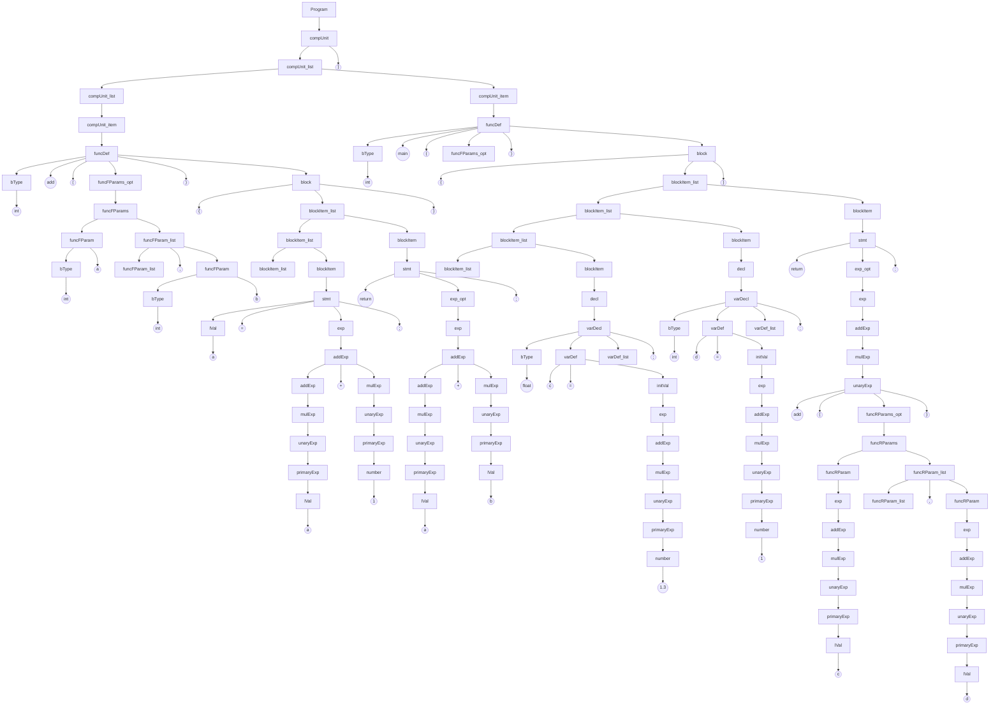

```mermaid
flowchart TD
    N0[Program]
    N1[compUnit]
    N0 --> N1
    N2[compUnit_list]
    N1 --> N2
    N3[compUnit_list]
    N2 --> N3
    N4[compUnit_item]
    N3 --> N4
    N5[funcDef]
    N4 --> N5
    N6[bType]
    N5 --> N6
    N7(("int"))
    N6 --> N7
    N8(("add"))
    N5 --> N8
    N9(("("))
    N5 --> N9
    N10[funcFParams_opt]
    N5 --> N10
    N11[funcFParams]
    N10 --> N11
    N12[funcFParam]
    N11 --> N12
    N13[bType]
    N12 --> N13
    N14(("int"))
    N13 --> N14
    N15(("a"))
    N12 --> N15
    N16[funcFParam_list]
    N11 --> N16
    N17[funcFParam_list]
    N16 --> N17
    N18((","))
    N16 --> N18
    N19[funcFParam]
    N16 --> N19
    N20[bType]
    N19 --> N20
    N21(("int"))
    N20 --> N21
    N22(("b"))
    N19 --> N22
    N23((")"))
    N5 --> N23
    N24[block]
    N5 --> N24
    N25(("{"))
    N24 --> N25
    N26[blockItem_list]
    N24 --> N26
    N27[blockItem_list]
    N26 --> N27
    N28[blockItem_list]
    N27 --> N28
    N29[blockItem]
    N27 --> N29
    N30[stmt]
    N29 --> N30
    N31[lVal]
    N30 --> N31
    N32(("a"))
    N31 --> N32
    N33(("="))
    N30 --> N33
    N34[exp]
    N30 --> N34
    N35[addExp]
    N34 --> N35
    N36[addExp]
    N35 --> N36
    N37[mulExp]
    N36 --> N37
    N38[unaryExp]
    N37 --> N38
    N39[primaryExp]
    N38 --> N39
    N40[lVal]
    N39 --> N40
    N41(("a"))
    N40 --> N41
    N42(("+"))
    N35 --> N42
    N43[mulExp]
    N35 --> N43
    N44[unaryExp]
    N43 --> N44
    N45[primaryExp]
    N44 --> N45
    N46[number]
    N45 --> N46
    N47(("1"))
    N46 --> N47
    N48((";"))
    N30 --> N48
    N49[blockItem]
    N26 --> N49
    N50[stmt]
    N49 --> N50
    N51(("return"))
    N50 --> N51
    N52[exp_opt]
    N50 --> N52
    N53[exp]
    N52 --> N53
    N54[addExp]
    N53 --> N54
    N55[addExp]
    N54 --> N55
    N56[mulExp]
    N55 --> N56
    N57[unaryExp]
    N56 --> N57
    N58[primaryExp]
    N57 --> N58
    N59[lVal]
    N58 --> N59
    N60(("a"))
    N59 --> N60
    N61(("+"))
    N54 --> N61
    N62[mulExp]
    N54 --> N62
    N63[unaryExp]
    N62 --> N63
    N64[primaryExp]
    N63 --> N64
    N65[lVal]
    N64 --> N65
    N66(("b"))
    N65 --> N66
    N67((";"))
    N50 --> N67
    N68(("}"))
    N24 --> N68
    N69[compUnit_item]
    N2 --> N69
    N70[funcDef]
    N69 --> N70
    N71[bType]
    N70 --> N71
    N72(("int"))
    N71 --> N72
    N73(("main"))
    N70 --> N73
    N74(("("))
    N70 --> N74
    N75[funcFParams_opt]
    N70 --> N75
    N76((")"))
    N70 --> N76
    N77[block]
    N70 --> N77
    N78(("{"))
    N77 --> N78
    N79[blockItem_list]
    N77 --> N79
    N80[blockItem_list]
    N79 --> N80
    N81[blockItem_list]
    N80 --> N81
    N82[blockItem_list]
    N81 --> N82
    N83[blockItem]
    N81 --> N83
    N84[decl]
    N83 --> N84
    N85[varDecl]
    N84 --> N85
    N86[bType]
    N85 --> N86
    N87(("float"))
    N86 --> N87
    N88[varDef]
    N85 --> N88
    N89(("c"))
    N88 --> N89
    N90(("="))
    N88 --> N90
    N91[initVal]
    N88 --> N91
    N92[exp]
    N91 --> N92
    N93[addExp]
    N92 --> N93
    N94[mulExp]
    N93 --> N94
    N95[unaryExp]
    N94 --> N95
    N96[primaryExp]
    N95 --> N96
    N97[number]
    N96 --> N97
    N98(("1.3"))
    N97 --> N98
    N99[varDef_list]
    N85 --> N99
    N100((";"))
    N85 --> N100
    N101[blockItem]
    N80 --> N101
    N102[decl]
    N101 --> N102
    N103[varDecl]
    N102 --> N103
    N104[bType]
    N103 --> N104
    N105(("int"))
    N104 --> N105
    N106[varDef]
    N103 --> N106
    N107(("d"))
    N106 --> N107
    N108(("="))
    N106 --> N108
    N109[initVal]
    N106 --> N109
    N110[exp]
    N109 --> N110
    N111[addExp]
    N110 --> N111
    N112[mulExp]
    N111 --> N112
    N113[unaryExp]
    N112 --> N113
    N114[primaryExp]
    N113 --> N114
    N115[number]
    N114 --> N115
    N116(("1"))
    N115 --> N116
    N117[varDef_list]
    N103 --> N117
    N118((";"))
    N103 --> N118
    N119[blockItem]
    N79 --> N119
    N120[stmt]
    N119 --> N120
    N121(("return"))
    N120 --> N121
    N122[exp_opt]
    N120 --> N122
    N123[exp]
    N122 --> N123
    N124[addExp]
    N123 --> N124
    N125[mulExp]
    N124 --> N125
    N126[unaryExp]
    N125 --> N126
    N127(("add"))
    N126 --> N127
    N128(("("))
    N126 --> N128
    N129[funcRParams_opt]
    N126 --> N129
    N130[funcRParams]
    N129 --> N130
    N131[funcRParam]
    N130 --> N131
    N132[exp]
    N131 --> N132
    N133[addExp]
    N132 --> N133
    N134[mulExp]
    N133 --> N134
    N135[unaryExp]
    N134 --> N135
    N136[primaryExp]
    N135 --> N136
    N137[lVal]
    N136 --> N137
    N138(("c"))
    N137 --> N138
    N139[funcRParam_list]
    N130 --> N139
    N140[funcRParam_list]
    N139 --> N140
    N141((","))
    N139 --> N141
    N142[funcRParam]
    N139 --> N142
    N143[exp]
    N142 --> N143
    N144[addExp]
    N143 --> N144
    N145[mulExp]
    N144 --> N145
    N146[unaryExp]
    N145 --> N146
    N147[primaryExp]
    N146 --> N147
    N148[lVal]
    N147 --> N148
    N149(("d"))
    N148 --> N149
    N150((")"))
    N126 --> N150
    N151((";"))
    N120 --> N151
    N152(("}"))
    N77 --> N152
    N153(("}"))
    N1 --> N153
```
