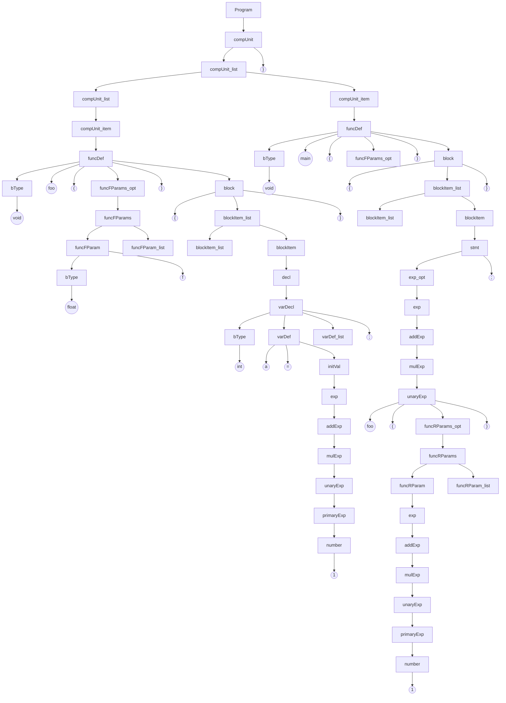

```mermaid
flowchart TD
    N0[Program]
    N1[compUnit]
    N0 --> N1
    N2[compUnit_list]
    N1 --> N2
    N3[compUnit_list]
    N2 --> N3
    N4[compUnit_item]
    N3 --> N4
    N5[funcDef]
    N4 --> N5
    N6[bType]
    N5 --> N6
    N7(("void"))
    N6 --> N7
    N8(("foo"))
    N5 --> N8
    N9(("("))
    N5 --> N9
    N10[funcFParams_opt]
    N5 --> N10
    N11[funcFParams]
    N10 --> N11
    N12[funcFParam]
    N11 --> N12
    N13[bType]
    N12 --> N13
    N14(("float"))
    N13 --> N14
    N15(("f"))
    N12 --> N15
    N16[funcFParam_list]
    N11 --> N16
    N17((")"))
    N5 --> N17
    N18[block]
    N5 --> N18
    N19(("{"))
    N18 --> N19
    N20[blockItem_list]
    N18 --> N20
    N21[blockItem_list]
    N20 --> N21
    N22[blockItem]
    N20 --> N22
    N23[decl]
    N22 --> N23
    N24[varDecl]
    N23 --> N24
    N25[bType]
    N24 --> N25
    N26(("int"))
    N25 --> N26
    N27[varDef]
    N24 --> N27
    N28(("a"))
    N27 --> N28
    N29(("="))
    N27 --> N29
    N30[initVal]
    N27 --> N30
    N31[exp]
    N30 --> N31
    N32[addExp]
    N31 --> N32
    N33[mulExp]
    N32 --> N33
    N34[unaryExp]
    N33 --> N34
    N35[primaryExp]
    N34 --> N35
    N36[number]
    N35 --> N36
    N37(("1"))
    N36 --> N37
    N38[varDef_list]
    N24 --> N38
    N39((";"))
    N24 --> N39
    N40(("}"))
    N18 --> N40
    N41[compUnit_item]
    N2 --> N41
    N42[funcDef]
    N41 --> N42
    N43[bType]
    N42 --> N43
    N44(("void"))
    N43 --> N44
    N45(("main"))
    N42 --> N45
    N46(("("))
    N42 --> N46
    N47[funcFParams_opt]
    N42 --> N47
    N48((")"))
    N42 --> N48
    N49[block]
    N42 --> N49
    N50(("{"))
    N49 --> N50
    N51[blockItem_list]
    N49 --> N51
    N52[blockItem_list]
    N51 --> N52
    N53[blockItem]
    N51 --> N53
    N54[stmt]
    N53 --> N54
    N55[exp_opt]
    N54 --> N55
    N56[exp]
    N55 --> N56
    N57[addExp]
    N56 --> N57
    N58[mulExp]
    N57 --> N58
    N59[unaryExp]
    N58 --> N59
    N60(("foo"))
    N59 --> N60
    N61(("("))
    N59 --> N61
    N62[funcRParams_opt]
    N59 --> N62
    N63[funcRParams]
    N62 --> N63
    N64[funcRParam]
    N63 --> N64
    N65[exp]
    N64 --> N65
    N66[addExp]
    N65 --> N66
    N67[mulExp]
    N66 --> N67
    N68[unaryExp]
    N67 --> N68
    N69[primaryExp]
    N68 --> N69
    N70[number]
    N69 --> N70
    N71(("1"))
    N70 --> N71
    N72[funcRParam_list]
    N63 --> N72
    N73((")"))
    N59 --> N73
    N74((";"))
    N54 --> N74
    N75(("}"))
    N49 --> N75
    N76(("}"))
    N1 --> N76
```
