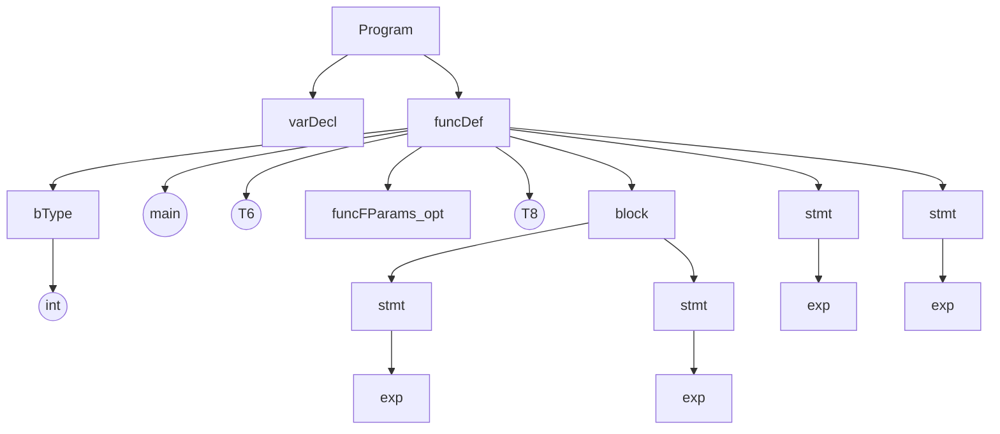

```mermaid
flowchart TD
    N0[Program]
    N1[varDecl]
    N0 --> N1
    N2[funcDef]
    N0 --> N2
    N3[bType]
    N2 --> N3
    N4((int))
    N3 --> N4
    N5((main))
    N2 --> N5
    N6((T6))
    N2 --> N6
    N7[funcFParams_opt]
    N2 --> N7
    N8((T8))
    N2 --> N8
    N9[block]
    N2 --> N9
    N10[stmt]
    N9 --> N10
    N11[exp]
    N10 --> N11
    N12[stmt]
    N9 --> N12
    N13[exp]
    N12 --> N13
    N14[stmt]
    N2 --> N14
    N15[exp]
    N14 --> N15
    N16[stmt]
    N2 --> N16
    N17[exp]
    N16 --> N17
```
