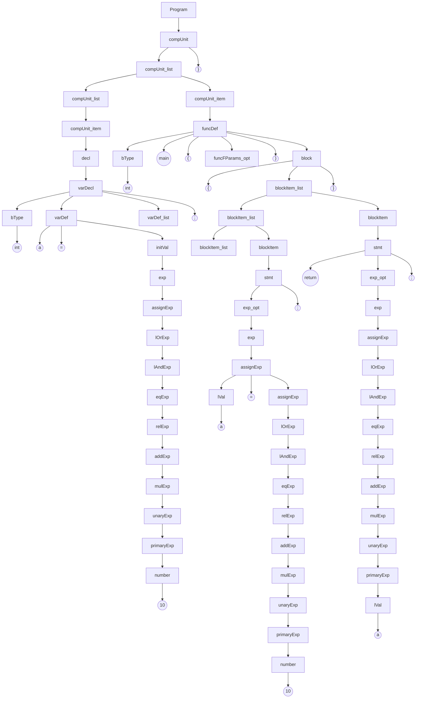

```mermaid
flowchart TD
    N0[Program]
    N1[compUnit]
    N0 --> N1
    N2[compUnit_list]
    N1 --> N2
    N3[compUnit_list]
    N2 --> N3
    N4[compUnit_item]
    N3 --> N4
    N5[decl]
    N4 --> N5
    N6[varDecl]
    N5 --> N6
    N7[bType]
    N6 --> N7
    N8(("int"))
    N7 --> N8
    N9[varDef]
    N6 --> N9
    N10(("a"))
    N9 --> N10
    N11(("="))
    N9 --> N11
    N12[initVal]
    N9 --> N12
    N13[exp]
    N12 --> N13
    N14[assignExp]
    N13 --> N14
    N15[lOrExp]
    N14 --> N15
    N16[lAndExp]
    N15 --> N16
    N17[eqExp]
    N16 --> N17
    N18[relExp]
    N17 --> N18
    N19[addExp]
    N18 --> N19
    N20[mulExp]
    N19 --> N20
    N21[unaryExp]
    N20 --> N21
    N22[primaryExp]
    N21 --> N22
    N23[number]
    N22 --> N23
    N24(("10"))
    N23 --> N24
    N25[varDef_list]
    N6 --> N25
    N26((";"))
    N6 --> N26
    N27[compUnit_item]
    N2 --> N27
    N28[funcDef]
    N27 --> N28
    N29[bType]
    N28 --> N29
    N30(("int"))
    N29 --> N30
    N31(("main"))
    N28 --> N31
    N32(("("))
    N28 --> N32
    N33[funcFParams_opt]
    N28 --> N33
    N34((")"))
    N28 --> N34
    N35[block]
    N28 --> N35
    N36(("{"))
    N35 --> N36
    N37[blockItem_list]
    N35 --> N37
    N38[blockItem_list]
    N37 --> N38
    N39[blockItem_list]
    N38 --> N39
    N40[blockItem]
    N38 --> N40
    N41[stmt]
    N40 --> N41
    N42[exp_opt]
    N41 --> N42
    N43[exp]
    N42 --> N43
    N44[assignExp]
    N43 --> N44
    N45[lVal]
    N44 --> N45
    N46(("a"))
    N45 --> N46
    N47(("="))
    N44 --> N47
    N48[assignExp]
    N44 --> N48
    N49[lOrExp]
    N48 --> N49
    N50[lAndExp]
    N49 --> N50
    N51[eqExp]
    N50 --> N51
    N52[relExp]
    N51 --> N52
    N53[addExp]
    N52 --> N53
    N54[mulExp]
    N53 --> N54
    N55[unaryExp]
    N54 --> N55
    N56[primaryExp]
    N55 --> N56
    N57[number]
    N56 --> N57
    N58(("10"))
    N57 --> N58
    N59((";"))
    N41 --> N59
    N60[blockItem]
    N37 --> N60
    N61[stmt]
    N60 --> N61
    N62(("return"))
    N61 --> N62
    N63[exp_opt]
    N61 --> N63
    N64[exp]
    N63 --> N64
    N65[assignExp]
    N64 --> N65
    N66[lOrExp]
    N65 --> N66
    N67[lAndExp]
    N66 --> N67
    N68[eqExp]
    N67 --> N68
    N69[relExp]
    N68 --> N69
    N70[addExp]
    N69 --> N70
    N71[mulExp]
    N70 --> N71
    N72[unaryExp]
    N71 --> N72
    N73[primaryExp]
    N72 --> N73
    N74[lVal]
    N73 --> N74
    N75(("a"))
    N74 --> N75
    N76((";"))
    N61 --> N76
    N77(("}"))
    N35 --> N77
    N78(("}"))
    N1 --> N78
```
