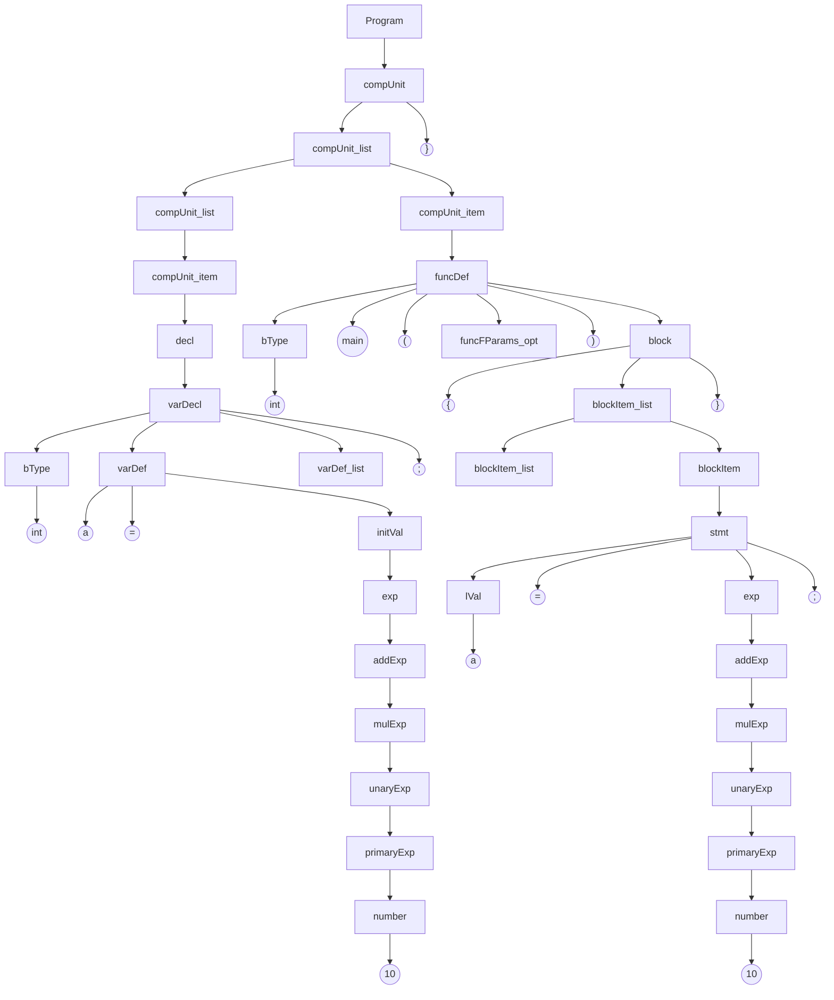

```mermaid
flowchart TD
    N0[Program]
    N1[compUnit]
    N0 --> N1
    N2[compUnit_list]
    N1 --> N2
    N3[compUnit_list]
    N2 --> N3
    N4[compUnit_item]
    N3 --> N4
    N5[decl]
    N4 --> N5
    N6[varDecl]
    N5 --> N6
    N7[bType]
    N6 --> N7
    N8(("int"))
    N7 --> N8
    N9[varDef]
    N6 --> N9
    N10(("a"))
    N9 --> N10
    N11(("="))
    N9 --> N11
    N12[initVal]
    N9 --> N12
    N13[exp]
    N12 --> N13
    N14[addExp]
    N13 --> N14
    N15[mulExp]
    N14 --> N15
    N16[unaryExp]
    N15 --> N16
    N17[primaryExp]
    N16 --> N17
    N18[number]
    N17 --> N18
    N19(("10"))
    N18 --> N19
    N20[varDef_list]
    N6 --> N20
    N21((";"))
    N6 --> N21
    N22[compUnit_item]
    N2 --> N22
    N23[funcDef]
    N22 --> N23
    N24[bType]
    N23 --> N24
    N25(("int"))
    N24 --> N25
    N26(("main"))
    N23 --> N26
    N27(("("))
    N23 --> N27
    N28[funcFParams_opt]
    N23 --> N28
    N29((")"))
    N23 --> N29
    N30[block]
    N23 --> N30
    N31(("{"))
    N30 --> N31
    N32[blockItem_list]
    N30 --> N32
    N33[blockItem_list]
    N32 --> N33
    N34[blockItem]
    N32 --> N34
    N35[stmt]
    N34 --> N35
    N36[lVal]
    N35 --> N36
    N37(("a"))
    N36 --> N37
    N38(("="))
    N35 --> N38
    N39[exp]
    N35 --> N39
    N40[addExp]
    N39 --> N40
    N41[mulExp]
    N40 --> N41
    N42[unaryExp]
    N41 --> N42
    N43[primaryExp]
    N42 --> N43
    N44[number]
    N43 --> N44
    N45(("10"))
    N44 --> N45
    N46((";"))
    N35 --> N46
    N47(("}"))
    N30 --> N47
    N48(("}"))
    N1 --> N48
```
