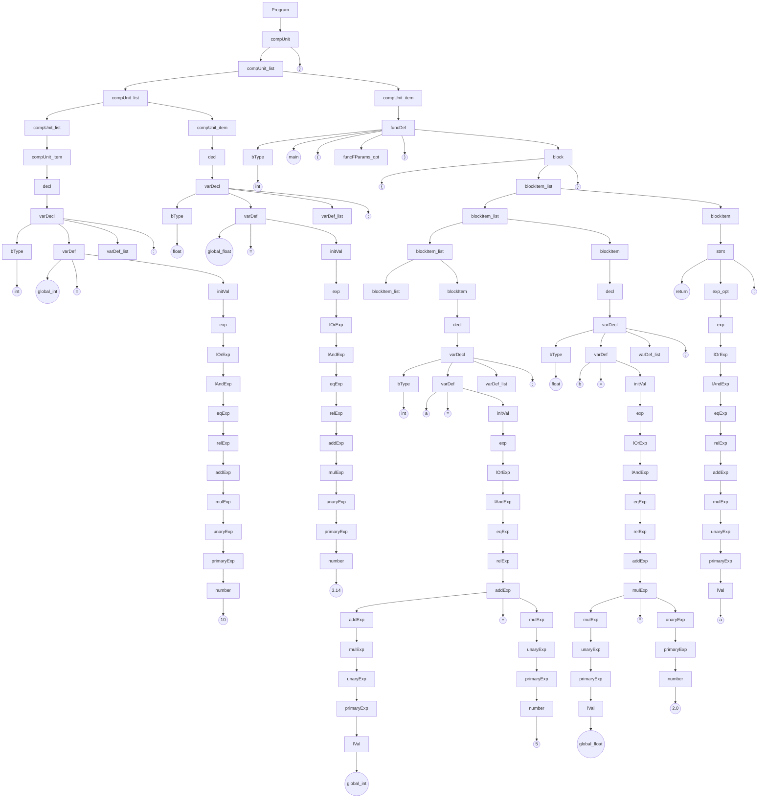

```mermaid
flowchart TD
    N0[Program]
    N1[compUnit]
    N0 --> N1
    N2[compUnit_list]
    N1 --> N2
    N3[compUnit_list]
    N2 --> N3
    N4[compUnit_list]
    N3 --> N4
    N5[compUnit_item]
    N4 --> N5
    N6[decl]
    N5 --> N6
    N7[varDecl]
    N6 --> N7
    N8[bType]
    N7 --> N8
    N9(("int"))
    N8 --> N9
    N10[varDef]
    N7 --> N10
    N11(("global_int"))
    N10 --> N11
    N12(("="))
    N10 --> N12
    N13[initVal]
    N10 --> N13
    N14[exp]
    N13 --> N14
    N15[lOrExp]
    N14 --> N15
    N16[lAndExp]
    N15 --> N16
    N17[eqExp]
    N16 --> N17
    N18[relExp]
    N17 --> N18
    N19[addExp]
    N18 --> N19
    N20[mulExp]
    N19 --> N20
    N21[unaryExp]
    N20 --> N21
    N22[primaryExp]
    N21 --> N22
    N23[number]
    N22 --> N23
    N24(("10"))
    N23 --> N24
    N25[varDef_list]
    N7 --> N25
    N26((";"))
    N7 --> N26
    N27[compUnit_item]
    N3 --> N27
    N28[decl]
    N27 --> N28
    N29[varDecl]
    N28 --> N29
    N30[bType]
    N29 --> N30
    N31(("float"))
    N30 --> N31
    N32[varDef]
    N29 --> N32
    N33(("global_float"))
    N32 --> N33
    N34(("="))
    N32 --> N34
    N35[initVal]
    N32 --> N35
    N36[exp]
    N35 --> N36
    N37[lOrExp]
    N36 --> N37
    N38[lAndExp]
    N37 --> N38
    N39[eqExp]
    N38 --> N39
    N40[relExp]
    N39 --> N40
    N41[addExp]
    N40 --> N41
    N42[mulExp]
    N41 --> N42
    N43[unaryExp]
    N42 --> N43
    N44[primaryExp]
    N43 --> N44
    N45[number]
    N44 --> N45
    N46(("3.14"))
    N45 --> N46
    N47[varDef_list]
    N29 --> N47
    N48((";"))
    N29 --> N48
    N49[compUnit_item]
    N2 --> N49
    N50[funcDef]
    N49 --> N50
    N51[bType]
    N50 --> N51
    N52(("int"))
    N51 --> N52
    N53(("main"))
    N50 --> N53
    N54(("("))
    N50 --> N54
    N55[funcFParams_opt]
    N50 --> N55
    N56((")"))
    N50 --> N56
    N57[block]
    N50 --> N57
    N58(("{"))
    N57 --> N58
    N59[blockItem_list]
    N57 --> N59
    N60[blockItem_list]
    N59 --> N60
    N61[blockItem_list]
    N60 --> N61
    N62[blockItem_list]
    N61 --> N62
    N63[blockItem]
    N61 --> N63
    N64[decl]
    N63 --> N64
    N65[varDecl]
    N64 --> N65
    N66[bType]
    N65 --> N66
    N67(("int"))
    N66 --> N67
    N68[varDef]
    N65 --> N68
    N69(("a"))
    N68 --> N69
    N70(("="))
    N68 --> N70
    N71[initVal]
    N68 --> N71
    N72[exp]
    N71 --> N72
    N73[lOrExp]
    N72 --> N73
    N74[lAndExp]
    N73 --> N74
    N75[eqExp]
    N74 --> N75
    N76[relExp]
    N75 --> N76
    N77[addExp]
    N76 --> N77
    N78[addExp]
    N77 --> N78
    N79[mulExp]
    N78 --> N79
    N80[unaryExp]
    N79 --> N80
    N81[primaryExp]
    N80 --> N81
    N82[lVal]
    N81 --> N82
    N83(("global_int"))
    N82 --> N83
    N84(("+"))
    N77 --> N84
    N85[mulExp]
    N77 --> N85
    N86[unaryExp]
    N85 --> N86
    N87[primaryExp]
    N86 --> N87
    N88[number]
    N87 --> N88
    N89(("5"))
    N88 --> N89
    N90[varDef_list]
    N65 --> N90
    N91((";"))
    N65 --> N91
    N92[blockItem]
    N60 --> N92
    N93[decl]
    N92 --> N93
    N94[varDecl]
    N93 --> N94
    N95[bType]
    N94 --> N95
    N96(("float"))
    N95 --> N96
    N97[varDef]
    N94 --> N97
    N98(("b"))
    N97 --> N98
    N99(("="))
    N97 --> N99
    N100[initVal]
    N97 --> N100
    N101[exp]
    N100 --> N101
    N102[lOrExp]
    N101 --> N102
    N103[lAndExp]
    N102 --> N103
    N104[eqExp]
    N103 --> N104
    N105[relExp]
    N104 --> N105
    N106[addExp]
    N105 --> N106
    N107[mulExp]
    N106 --> N107
    N108[mulExp]
    N107 --> N108
    N109[unaryExp]
    N108 --> N109
    N110[primaryExp]
    N109 --> N110
    N111[lVal]
    N110 --> N111
    N112(("global_float"))
    N111 --> N112
    N113(("*"))
    N107 --> N113
    N114[unaryExp]
    N107 --> N114
    N115[primaryExp]
    N114 --> N115
    N116[number]
    N115 --> N116
    N117(("2.0"))
    N116 --> N117
    N118[varDef_list]
    N94 --> N118
    N119((";"))
    N94 --> N119
    N120[blockItem]
    N59 --> N120
    N121[stmt]
    N120 --> N121
    N122(("return"))
    N121 --> N122
    N123[exp_opt]
    N121 --> N123
    N124[exp]
    N123 --> N124
    N125[lOrExp]
    N124 --> N125
    N126[lAndExp]
    N125 --> N126
    N127[eqExp]
    N126 --> N127
    N128[relExp]
    N127 --> N128
    N129[addExp]
    N128 --> N129
    N130[mulExp]
    N129 --> N130
    N131[unaryExp]
    N130 --> N131
    N132[primaryExp]
    N131 --> N132
    N133[lVal]
    N132 --> N133
    N134(("a"))
    N133 --> N134
    N135((";"))
    N121 --> N135
    N136(("}"))
    N57 --> N136
    N137(("}"))
    N1 --> N137
```
