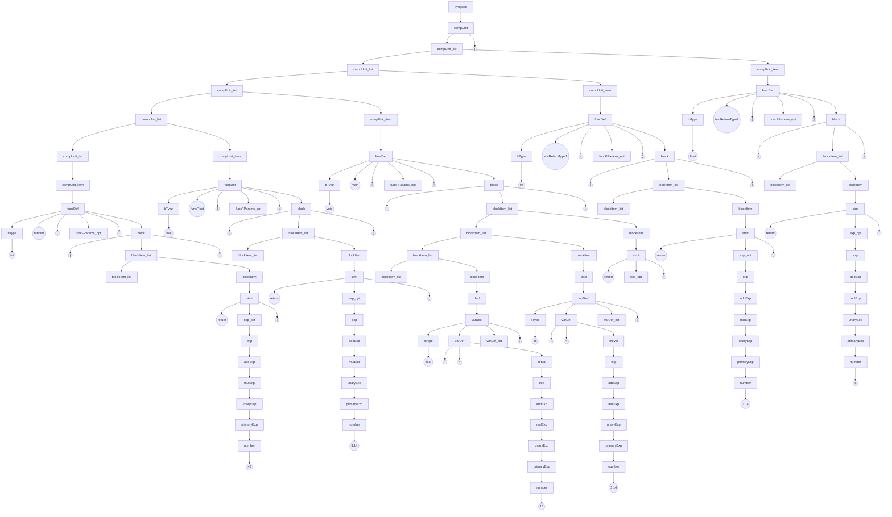

```mermaid
flowchart TD
    N0[Program]
    N1[compUnit]
    N0 --> N1
    N2[compUnit_list]
    N1 --> N2
    N3[compUnit_list]
    N2 --> N3
    N4[compUnit_list]
    N3 --> N4
    N5[compUnit_list]
    N4 --> N5
    N6[compUnit_list]
    N5 --> N6
    N7[compUnit_item]
    N6 --> N7
    N8[funcDef]
    N7 --> N8
    N9[bType]
    N8 --> N9
    N10(("int"))
    N9 --> N10
    N11(("funcInt"))
    N8 --> N11
    N12(("("))
    N8 --> N12
    N13[funcFParams_opt]
    N8 --> N13
    N14((")"))
    N8 --> N14
    N15[block]
    N8 --> N15
    N16(("{"))
    N15 --> N16
    N17[blockItem_list]
    N15 --> N17
    N18[blockItem_list]
    N17 --> N18
    N19[blockItem]
    N17 --> N19
    N20[stmt]
    N19 --> N20
    N21(("return"))
    N20 --> N21
    N22[exp_opt]
    N20 --> N22
    N23[exp]
    N22 --> N23
    N24[addExp]
    N23 --> N24
    N25[mulExp]
    N24 --> N25
    N26[unaryExp]
    N25 --> N26
    N27[primaryExp]
    N26 --> N27
    N28[number]
    N27 --> N28
    N29(("42"))
    N28 --> N29
    N30((";"))
    N20 --> N30
    N31(("}"))
    N15 --> N31
    N32[compUnit_item]
    N5 --> N32
    N33[funcDef]
    N32 --> N33
    N34[bType]
    N33 --> N34
    N35(("float"))
    N34 --> N35
    N36(("funcFloat"))
    N33 --> N36
    N37(("("))
    N33 --> N37
    N38[funcFParams_opt]
    N33 --> N38
    N39((")"))
    N33 --> N39
    N40[block]
    N33 --> N40
    N41(("{"))
    N40 --> N41
    N42[blockItem_list]
    N40 --> N42
    N43[blockItem_list]
    N42 --> N43
    N44[blockItem]
    N42 --> N44
    N45[stmt]
    N44 --> N45
    N46(("return"))
    N45 --> N46
    N47[exp_opt]
    N45 --> N47
    N48[exp]
    N47 --> N48
    N49[addExp]
    N48 --> N49
    N50[mulExp]
    N49 --> N50
    N51[unaryExp]
    N50 --> N51
    N52[primaryExp]
    N51 --> N52
    N53[number]
    N52 --> N53
    N54(("3.14"))
    N53 --> N54
    N55((";"))
    N45 --> N55
    N56(("}"))
    N40 --> N56
    N57[compUnit_item]
    N4 --> N57
    N58[funcDef]
    N57 --> N58
    N59[bType]
    N58 --> N59
    N60(("void"))
    N59 --> N60
    N61(("main"))
    N58 --> N61
    N62(("("))
    N58 --> N62
    N63[funcFParams_opt]
    N58 --> N63
    N64((")"))
    N58 --> N64
    N65[block]
    N58 --> N65
    N66(("{"))
    N65 --> N66
    N67[blockItem_list]
    N65 --> N67
    N68[blockItem_list]
    N67 --> N68
    N69[blockItem_list]
    N68 --> N69
    N70[blockItem_list]
    N69 --> N70
    N71[blockItem]
    N69 --> N71
    N72[decl]
    N71 --> N72
    N73[varDecl]
    N72 --> N73
    N74[bType]
    N73 --> N74
    N75(("float"))
    N74 --> N75
    N76[varDef]
    N73 --> N76
    N77(("f"))
    N76 --> N77
    N78(("="))
    N76 --> N78
    N79[initVal]
    N76 --> N79
    N80[exp]
    N79 --> N80
    N81[addExp]
    N80 --> N81
    N82[mulExp]
    N81 --> N82
    N83[unaryExp]
    N82 --> N83
    N84[primaryExp]
    N83 --> N84
    N85[number]
    N84 --> N85
    N86(("10"))
    N85 --> N86
    N87[varDef_list]
    N73 --> N87
    N88((";"))
    N73 --> N88
    N89[blockItem]
    N68 --> N89
    N90[decl]
    N89 --> N90
    N91[varDecl]
    N90 --> N91
    N92[bType]
    N91 --> N92
    N93(("int"))
    N92 --> N93
    N94[varDef]
    N91 --> N94
    N95(("i"))
    N94 --> N95
    N96(("="))
    N94 --> N96
    N97[initVal]
    N94 --> N97
    N98[exp]
    N97 --> N98
    N99[addExp]
    N98 --> N99
    N100[mulExp]
    N99 --> N100
    N101[unaryExp]
    N100 --> N101
    N102[primaryExp]
    N101 --> N102
    N103[number]
    N102 --> N103
    N104(("3.14"))
    N103 --> N104
    N105[varDef_list]
    N91 --> N105
    N106((";"))
    N91 --> N106
    N107[blockItem]
    N67 --> N107
    N108[stmt]
    N107 --> N108
    N109(("return"))
    N108 --> N109
    N110[exp_opt]
    N108 --> N110
    N111((";"))
    N108 --> N111
    N112(("}"))
    N65 --> N112
    N113[compUnit_item]
    N3 --> N113
    N114[funcDef]
    N113 --> N114
    N115[bType]
    N114 --> N115
    N116(("int"))
    N115 --> N116
    N117(("testReturnType1"))
    N114 --> N117
    N118(("("))
    N114 --> N118
    N119[funcFParams_opt]
    N114 --> N119
    N120((")"))
    N114 --> N120
    N121[block]
    N114 --> N121
    N122(("{"))
    N121 --> N122
    N123[blockItem_list]
    N121 --> N123
    N124[blockItem_list]
    N123 --> N124
    N125[blockItem]
    N123 --> N125
    N126[stmt]
    N125 --> N126
    N127(("return"))
    N126 --> N127
    N128[exp_opt]
    N126 --> N128
    N129[exp]
    N128 --> N129
    N130[addExp]
    N129 --> N130
    N131[mulExp]
    N130 --> N131
    N132[unaryExp]
    N131 --> N132
    N133[primaryExp]
    N132 --> N133
    N134[number]
    N133 --> N134
    N135(("3.14"))
    N134 --> N135
    N136((";"))
    N126 --> N136
    N137(("}"))
    N121 --> N137
    N138[compUnit_item]
    N2 --> N138
    N139[funcDef]
    N138 --> N139
    N140[bType]
    N139 --> N140
    N141(("float"))
    N140 --> N141
    N142(("testReturnType2"))
    N139 --> N142
    N143(("("))
    N139 --> N143
    N144[funcFParams_opt]
    N139 --> N144
    N145((")"))
    N139 --> N145
    N146[block]
    N139 --> N146
    N147(("{"))
    N146 --> N147
    N148[blockItem_list]
    N146 --> N148
    N149[blockItem_list]
    N148 --> N149
    N150[blockItem]
    N148 --> N150
    N151[stmt]
    N150 --> N151
    N152(("return"))
    N151 --> N152
    N153[exp_opt]
    N151 --> N153
    N154[exp]
    N153 --> N154
    N155[addExp]
    N154 --> N155
    N156[mulExp]
    N155 --> N156
    N157[unaryExp]
    N156 --> N157
    N158[primaryExp]
    N157 --> N158
    N159[number]
    N158 --> N159
    N160(("5"))
    N159 --> N160
    N161((";"))
    N151 --> N161
    N162(("}"))
    N146 --> N162
    N163(("}"))
    N1 --> N163
```
