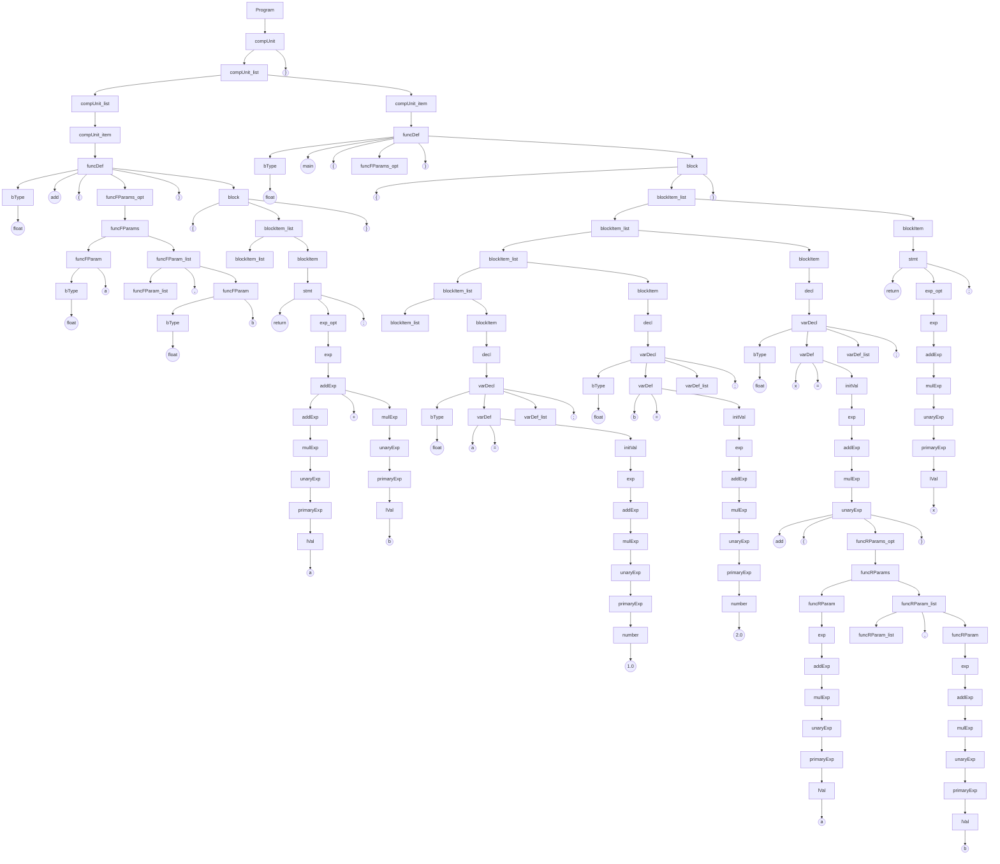

```mermaid
flowchart TD
    N0[Program]
    N1[compUnit]
    N0 --> N1
    N2[compUnit_list]
    N1 --> N2
    N3[compUnit_list]
    N2 --> N3
    N4[compUnit_item]
    N3 --> N4
    N5[funcDef]
    N4 --> N5
    N6[bType]
    N5 --> N6
    N7(("float"))
    N6 --> N7
    N8(("add"))
    N5 --> N8
    N9(("("))
    N5 --> N9
    N10[funcFParams_opt]
    N5 --> N10
    N11[funcFParams]
    N10 --> N11
    N12[funcFParam]
    N11 --> N12
    N13[bType]
    N12 --> N13
    N14(("float"))
    N13 --> N14
    N15(("a"))
    N12 --> N15
    N16[funcFParam_list]
    N11 --> N16
    N17[funcFParam_list]
    N16 --> N17
    N18((","))
    N16 --> N18
    N19[funcFParam]
    N16 --> N19
    N20[bType]
    N19 --> N20
    N21(("float"))
    N20 --> N21
    N22(("b"))
    N19 --> N22
    N23((")"))
    N5 --> N23
    N24[block]
    N5 --> N24
    N25(("{"))
    N24 --> N25
    N26[blockItem_list]
    N24 --> N26
    N27[blockItem_list]
    N26 --> N27
    N28[blockItem]
    N26 --> N28
    N29[stmt]
    N28 --> N29
    N30(("return"))
    N29 --> N30
    N31[exp_opt]
    N29 --> N31
    N32[exp]
    N31 --> N32
    N33[addExp]
    N32 --> N33
    N34[addExp]
    N33 --> N34
    N35[mulExp]
    N34 --> N35
    N36[unaryExp]
    N35 --> N36
    N37[primaryExp]
    N36 --> N37
    N38[lVal]
    N37 --> N38
    N39(("a"))
    N38 --> N39
    N40(("+"))
    N33 --> N40
    N41[mulExp]
    N33 --> N41
    N42[unaryExp]
    N41 --> N42
    N43[primaryExp]
    N42 --> N43
    N44[lVal]
    N43 --> N44
    N45(("b"))
    N44 --> N45
    N46((";"))
    N29 --> N46
    N47(("}"))
    N24 --> N47
    N48[compUnit_item]
    N2 --> N48
    N49[funcDef]
    N48 --> N49
    N50[bType]
    N49 --> N50
    N51(("float"))
    N50 --> N51
    N52(("main"))
    N49 --> N52
    N53(("("))
    N49 --> N53
    N54[funcFParams_opt]
    N49 --> N54
    N55((")"))
    N49 --> N55
    N56[block]
    N49 --> N56
    N57(("{"))
    N56 --> N57
    N58[blockItem_list]
    N56 --> N58
    N59[blockItem_list]
    N58 --> N59
    N60[blockItem_list]
    N59 --> N60
    N61[blockItem_list]
    N60 --> N61
    N62[blockItem_list]
    N61 --> N62
    N63[blockItem]
    N61 --> N63
    N64[decl]
    N63 --> N64
    N65[varDecl]
    N64 --> N65
    N66[bType]
    N65 --> N66
    N67(("float"))
    N66 --> N67
    N68[varDef]
    N65 --> N68
    N69(("a"))
    N68 --> N69
    N70(("="))
    N68 --> N70
    N71[initVal]
    N68 --> N71
    N72[exp]
    N71 --> N72
    N73[addExp]
    N72 --> N73
    N74[mulExp]
    N73 --> N74
    N75[unaryExp]
    N74 --> N75
    N76[primaryExp]
    N75 --> N76
    N77[number]
    N76 --> N77
    N78(("1.0"))
    N77 --> N78
    N79[varDef_list]
    N65 --> N79
    N80((";"))
    N65 --> N80
    N81[blockItem]
    N60 --> N81
    N82[decl]
    N81 --> N82
    N83[varDecl]
    N82 --> N83
    N84[bType]
    N83 --> N84
    N85(("float"))
    N84 --> N85
    N86[varDef]
    N83 --> N86
    N87(("b"))
    N86 --> N87
    N88(("="))
    N86 --> N88
    N89[initVal]
    N86 --> N89
    N90[exp]
    N89 --> N90
    N91[addExp]
    N90 --> N91
    N92[mulExp]
    N91 --> N92
    N93[unaryExp]
    N92 --> N93
    N94[primaryExp]
    N93 --> N94
    N95[number]
    N94 --> N95
    N96(("2.0"))
    N95 --> N96
    N97[varDef_list]
    N83 --> N97
    N98((";"))
    N83 --> N98
    N99[blockItem]
    N59 --> N99
    N100[decl]
    N99 --> N100
    N101[varDecl]
    N100 --> N101
    N102[bType]
    N101 --> N102
    N103(("float"))
    N102 --> N103
    N104[varDef]
    N101 --> N104
    N105(("x"))
    N104 --> N105
    N106(("="))
    N104 --> N106
    N107[initVal]
    N104 --> N107
    N108[exp]
    N107 --> N108
    N109[addExp]
    N108 --> N109
    N110[mulExp]
    N109 --> N110
    N111[unaryExp]
    N110 --> N111
    N112(("add"))
    N111 --> N112
    N113(("("))
    N111 --> N113
    N114[funcRParams_opt]
    N111 --> N114
    N115[funcRParams]
    N114 --> N115
    N116[funcRParam]
    N115 --> N116
    N117[exp]
    N116 --> N117
    N118[addExp]
    N117 --> N118
    N119[mulExp]
    N118 --> N119
    N120[unaryExp]
    N119 --> N120
    N121[primaryExp]
    N120 --> N121
    N122[lVal]
    N121 --> N122
    N123(("a"))
    N122 --> N123
    N124[funcRParam_list]
    N115 --> N124
    N125[funcRParam_list]
    N124 --> N125
    N126((","))
    N124 --> N126
    N127[funcRParam]
    N124 --> N127
    N128[exp]
    N127 --> N128
    N129[addExp]
    N128 --> N129
    N130[mulExp]
    N129 --> N130
    N131[unaryExp]
    N130 --> N131
    N132[primaryExp]
    N131 --> N132
    N133[lVal]
    N132 --> N133
    N134(("b"))
    N133 --> N134
    N135((")"))
    N111 --> N135
    N136[varDef_list]
    N101 --> N136
    N137((";"))
    N101 --> N137
    N138[blockItem]
    N58 --> N138
    N139[stmt]
    N138 --> N139
    N140(("return"))
    N139 --> N140
    N141[exp_opt]
    N139 --> N141
    N142[exp]
    N141 --> N142
    N143[addExp]
    N142 --> N143
    N144[mulExp]
    N143 --> N144
    N145[unaryExp]
    N144 --> N145
    N146[primaryExp]
    N145 --> N146
    N147[lVal]
    N146 --> N147
    N148(("x"))
    N147 --> N148
    N149((";"))
    N139 --> N149
    N150(("}"))
    N56 --> N150
    N151(("}"))
    N1 --> N151
```
