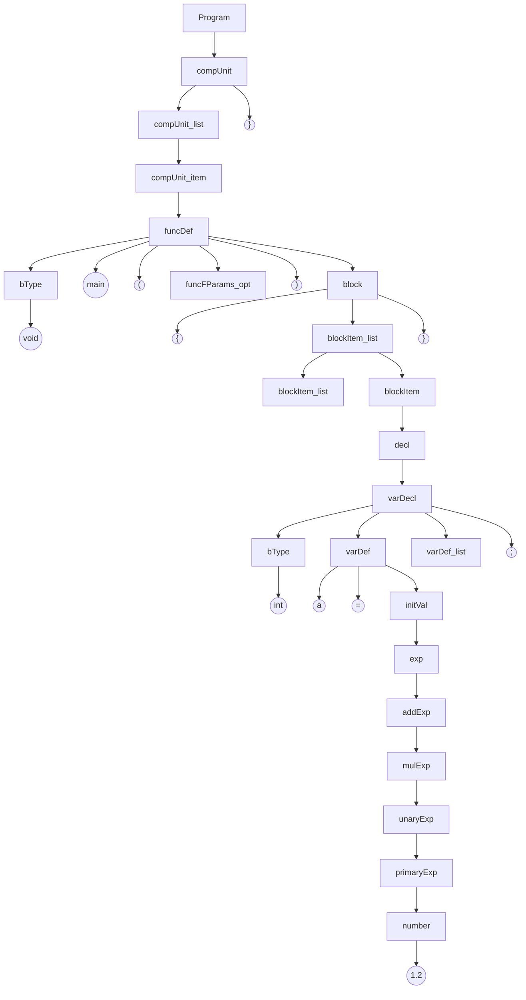

```mermaid
flowchart TD
    N0[Program]
    N1[compUnit]
    N0 --> N1
    N2[compUnit_list]
    N1 --> N2
    N3[compUnit_item]
    N2 --> N3
    N4[funcDef]
    N3 --> N4
    N5[bType]
    N4 --> N5
    N6(("void"))
    N5 --> N6
    N7(("main"))
    N4 --> N7
    N8(("("))
    N4 --> N8
    N9[funcFParams_opt]
    N4 --> N9
    N10((")"))
    N4 --> N10
    N11[block]
    N4 --> N11
    N12(("{"))
    N11 --> N12
    N13[blockItem_list]
    N11 --> N13
    N14[blockItem_list]
    N13 --> N14
    N15[blockItem]
    N13 --> N15
    N16[decl]
    N15 --> N16
    N17[varDecl]
    N16 --> N17
    N18[bType]
    N17 --> N18
    N19(("int"))
    N18 --> N19
    N20[varDef]
    N17 --> N20
    N21(("a"))
    N20 --> N21
    N22(("="))
    N20 --> N22
    N23[initVal]
    N20 --> N23
    N24[exp]
    N23 --> N24
    N25[addExp]
    N24 --> N25
    N26[mulExp]
    N25 --> N26
    N27[unaryExp]
    N26 --> N27
    N28[primaryExp]
    N27 --> N28
    N29[number]
    N28 --> N29
    N30(("1.2"))
    N29 --> N30
    N31[varDef_list]
    N17 --> N31
    N32((";"))
    N17 --> N32
    N33(("}"))
    N11 --> N33
    N34(("}"))
    N1 --> N34
```
