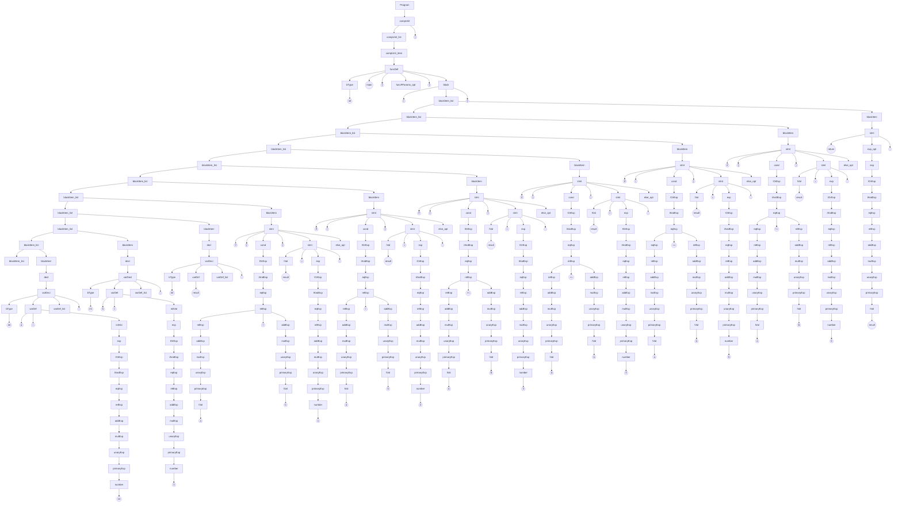

```mermaid
flowchart TD
    N0[Program]
    N1[compUnit]
    N0 --> N1
    N2[compUnit_list]
    N1 --> N2
    N3[compUnit_item]
    N2 --> N3
    N4[funcDef]
    N3 --> N4
    N5[bType]
    N4 --> N5
    N6(("int"))
    N5 --> N6
    N7(("main"))
    N4 --> N7
    N8(("("))
    N4 --> N8
    N9[funcFParams_opt]
    N4 --> N9
    N10((")"))
    N4 --> N10
    N11[block]
    N4 --> N11
    N12(("{"))
    N11 --> N12
    N13[blockItem_list]
    N11 --> N13
    N14[blockItem_list]
    N13 --> N14
    N15[blockItem_list]
    N14 --> N15
    N16[blockItem_list]
    N15 --> N16
    N17[blockItem_list]
    N16 --> N17
    N18[blockItem_list]
    N17 --> N18
    N19[blockItem_list]
    N18 --> N19
    N20[blockItem_list]
    N19 --> N20
    N21[blockItem_list]
    N20 --> N21
    N22[blockItem_list]
    N21 --> N22
    N23[blockItem_list]
    N22 --> N23
    N24[blockItem]
    N22 --> N24
    N25[decl]
    N24 --> N25
    N26[varDecl]
    N25 --> N26
    N27[bType]
    N26 --> N27
    N28(("int"))
    N27 --> N28
    N29[varDef]
    N26 --> N29
    N30(("a"))
    N29 --> N30
    N31(("="))
    N29 --> N31
    N32[initVal]
    N29 --> N32
    N33[exp]
    N32 --> N33
    N34[lOrExp]
    N33 --> N34
    N35[lAndExp]
    N34 --> N35
    N36[eqExp]
    N35 --> N36
    N37[relExp]
    N36 --> N37
    N38[addExp]
    N37 --> N38
    N39[mulExp]
    N38 --> N39
    N40[unaryExp]
    N39 --> N40
    N41[primaryExp]
    N40 --> N41
    N42[number]
    N41 --> N42
    N43(("10"))
    N42 --> N43
    N44[varDef_list]
    N26 --> N44
    N45((";"))
    N26 --> N45
    N46[blockItem]
    N21 --> N46
    N47[decl]
    N46 --> N47
    N48[varDecl]
    N47 --> N48
    N49[bType]
    N48 --> N49
    N50(("int"))
    N49 --> N50
    N51[varDef]
    N48 --> N51
    N52(("b"))
    N51 --> N52
    N53(("="))
    N51 --> N53
    N54[initVal]
    N51 --> N54
    N55[exp]
    N54 --> N55
    N56[lOrExp]
    N55 --> N56
    N57[lAndExp]
    N56 --> N57
    N58[eqExp]
    N57 --> N58
    N59[relExp]
    N58 --> N59
    N60[addExp]
    N59 --> N60
    N61[mulExp]
    N60 --> N61
    N62[unaryExp]
    N61 --> N62
    N63[primaryExp]
    N62 --> N63
    N64[number]
    N63 --> N64
    N65(("3"))
    N64 --> N65
    N66[varDef_list]
    N48 --> N66
    N67((";"))
    N48 --> N67
    N68[blockItem]
    N20 --> N68
    N69[decl]
    N68 --> N69
    N70[varDecl]
    N69 --> N70
    N71[bType]
    N70 --> N71
    N72(("int"))
    N71 --> N72
    N73[varDef]
    N70 --> N73
    N74(("result"))
    N73 --> N74
    N75[varDef_list]
    N70 --> N75
    N76((";"))
    N70 --> N76
    N77[blockItem]
    N19 --> N77
    N78[stmt]
    N77 --> N78
    N79(("if"))
    N78 --> N79
    N80(("("))
    N78 --> N80
    N81[cond]
    N78 --> N81
    N82[lOrExp]
    N81 --> N82
    N83[lAndExp]
    N82 --> N83
    N84[eqExp]
    N83 --> N84
    N85[relExp]
    N84 --> N85
    N86[relExp]
    N85 --> N86
    N87[addExp]
    N86 --> N87
    N88[mulExp]
    N87 --> N88
    N89[unaryExp]
    N88 --> N89
    N90[primaryExp]
    N89 --> N90
    N91[lVal]
    N90 --> N91
    N92(("a"))
    N91 --> N92
    N93((">"))
    N85 --> N93
    N94[addExp]
    N85 --> N94
    N95[mulExp]
    N94 --> N95
    N96[unaryExp]
    N95 --> N96
    N97[primaryExp]
    N96 --> N97
    N98[lVal]
    N97 --> N98
    N99(("b"))
    N98 --> N99
    N100((")"))
    N78 --> N100
    N101[stmt]
    N78 --> N101
    N102[lVal]
    N101 --> N102
    N103(("result"))
    N102 --> N103
    N104(("="))
    N101 --> N104
    N105[exp]
    N101 --> N105
    N106[lOrExp]
    N105 --> N106
    N107[lAndExp]
    N106 --> N107
    N108[eqExp]
    N107 --> N108
    N109[relExp]
    N108 --> N109
    N110[addExp]
    N109 --> N110
    N111[mulExp]
    N110 --> N111
    N112[unaryExp]
    N111 --> N112
    N113[primaryExp]
    N112 --> N113
    N114[number]
    N113 --> N114
    N115(("1"))
    N114 --> N115
    N116((";"))
    N101 --> N116
    N117[else_opt]
    N78 --> N117
    N118[blockItem]
    N18 --> N118
    N119[stmt]
    N118 --> N119
    N120(("if"))
    N119 --> N120
    N121(("("))
    N119 --> N121
    N122[cond]
    N119 --> N122
    N123[lOrExp]
    N122 --> N123
    N124[lAndExp]
    N123 --> N124
    N125[eqExp]
    N124 --> N125
    N126[relExp]
    N125 --> N126
    N127[relExp]
    N126 --> N127
    N128[addExp]
    N127 --> N128
    N129[mulExp]
    N128 --> N129
    N130[unaryExp]
    N129 --> N130
    N131[primaryExp]
    N130 --> N131
    N132[lVal]
    N131 --> N132
    N133(("a"))
    N132 --> N133
    N134(("<"))
    N126 --> N134
    N135[addExp]
    N126 --> N135
    N136[mulExp]
    N135 --> N136
    N137[unaryExp]
    N136 --> N137
    N138[primaryExp]
    N137 --> N138
    N139[lVal]
    N138 --> N139
    N140(("b"))
    N139 --> N140
    N141((")"))
    N119 --> N141
    N142[stmt]
    N119 --> N142
    N143[lVal]
    N142 --> N143
    N144(("result"))
    N143 --> N144
    N145(("="))
    N142 --> N145
    N146[exp]
    N142 --> N146
    N147[lOrExp]
    N146 --> N147
    N148[lAndExp]
    N147 --> N148
    N149[eqExp]
    N148 --> N149
    N150[relExp]
    N149 --> N150
    N151[addExp]
    N150 --> N151
    N152[mulExp]
    N151 --> N152
    N153[unaryExp]
    N152 --> N153
    N154[primaryExp]
    N153 --> N154
    N155[number]
    N154 --> N155
    N156(("2"))
    N155 --> N156
    N157((";"))
    N142 --> N157
    N158[else_opt]
    N119 --> N158
    N159[blockItem]
    N17 --> N159
    N160[stmt]
    N159 --> N160
    N161(("if"))
    N160 --> N161
    N162(("("))
    N160 --> N162
    N163[cond]
    N160 --> N163
    N164[lOrExp]
    N163 --> N164
    N165[lAndExp]
    N164 --> N165
    N166[eqExp]
    N165 --> N166
    N167[relExp]
    N166 --> N167
    N168[relExp]
    N167 --> N168
    N169[addExp]
    N168 --> N169
    N170[mulExp]
    N169 --> N170
    N171[unaryExp]
    N170 --> N171
    N172[primaryExp]
    N171 --> N172
    N173[lVal]
    N172 --> N173
    N174(("a"))
    N173 --> N174
    N175((">="))
    N167 --> N175
    N176[addExp]
    N167 --> N176
    N177[mulExp]
    N176 --> N177
    N178[unaryExp]
    N177 --> N178
    N179[primaryExp]
    N178 --> N179
    N180[lVal]
    N179 --> N180
    N181(("b"))
    N180 --> N181
    N182((")"))
    N160 --> N182
    N183[stmt]
    N160 --> N183
    N184[lVal]
    N183 --> N184
    N185(("result"))
    N184 --> N185
    N186(("="))
    N183 --> N186
    N187[exp]
    N183 --> N187
    N188[lOrExp]
    N187 --> N188
    N189[lAndExp]
    N188 --> N189
    N190[eqExp]
    N189 --> N190
    N191[relExp]
    N190 --> N191
    N192[addExp]
    N191 --> N192
    N193[mulExp]
    N192 --> N193
    N194[unaryExp]
    N193 --> N194
    N195[primaryExp]
    N194 --> N195
    N196[number]
    N195 --> N196
    N197(("3"))
    N196 --> N197
    N198((";"))
    N183 --> N198
    N199[else_opt]
    N160 --> N199
    N200[blockItem]
    N16 --> N200
    N201[stmt]
    N200 --> N201
    N202(("if"))
    N201 --> N202
    N203(("("))
    N201 --> N203
    N204[cond]
    N201 --> N204
    N205[lOrExp]
    N204 --> N205
    N206[lAndExp]
    N205 --> N206
    N207[eqExp]
    N206 --> N207
    N208[relExp]
    N207 --> N208
    N209[relExp]
    N208 --> N209
    N210[addExp]
    N209 --> N210
    N211[mulExp]
    N210 --> N211
    N212[unaryExp]
    N211 --> N212
    N213[primaryExp]
    N212 --> N213
    N214[lVal]
    N213 --> N214
    N215(("a"))
    N214 --> N215
    N216(("<="))
    N208 --> N216
    N217[addExp]
    N208 --> N217
    N218[mulExp]
    N217 --> N218
    N219[unaryExp]
    N218 --> N219
    N220[primaryExp]
    N219 --> N220
    N221[lVal]
    N220 --> N221
    N222(("b"))
    N221 --> N222
    N223((")"))
    N201 --> N223
    N224[stmt]
    N201 --> N224
    N225[lVal]
    N224 --> N225
    N226(("result"))
    N225 --> N226
    N227(("="))
    N224 --> N227
    N228[exp]
    N224 --> N228
    N229[lOrExp]
    N228 --> N229
    N230[lAndExp]
    N229 --> N230
    N231[eqExp]
    N230 --> N231
    N232[relExp]
    N231 --> N232
    N233[addExp]
    N232 --> N233
    N234[mulExp]
    N233 --> N234
    N235[unaryExp]
    N234 --> N235
    N236[primaryExp]
    N235 --> N236
    N237[number]
    N236 --> N237
    N238(("4"))
    N237 --> N238
    N239((";"))
    N224 --> N239
    N240[else_opt]
    N201 --> N240
    N241[blockItem]
    N15 --> N241
    N242[stmt]
    N241 --> N242
    N243(("if"))
    N242 --> N243
    N244(("("))
    N242 --> N244
    N245[cond]
    N242 --> N245
    N246[lOrExp]
    N245 --> N246
    N247[lAndExp]
    N246 --> N247
    N248[eqExp]
    N247 --> N248
    N249[eqExp]
    N248 --> N249
    N250[relExp]
    N249 --> N250
    N251[addExp]
    N250 --> N251
    N252[mulExp]
    N251 --> N252
    N253[unaryExp]
    N252 --> N253
    N254[primaryExp]
    N253 --> N254
    N255[lVal]
    N254 --> N255
    N256(("a"))
    N255 --> N256
    N257(("=="))
    N248 --> N257
    N258[relExp]
    N248 --> N258
    N259[addExp]
    N258 --> N259
    N260[mulExp]
    N259 --> N260
    N261[unaryExp]
    N260 --> N261
    N262[primaryExp]
    N261 --> N262
    N263[lVal]
    N262 --> N263
    N264(("b"))
    N263 --> N264
    N265((")"))
    N242 --> N265
    N266[stmt]
    N242 --> N266
    N267[lVal]
    N266 --> N267
    N268(("result"))
    N267 --> N268
    N269(("="))
    N266 --> N269
    N270[exp]
    N266 --> N270
    N271[lOrExp]
    N270 --> N271
    N272[lAndExp]
    N271 --> N272
    N273[eqExp]
    N272 --> N273
    N274[relExp]
    N273 --> N274
    N275[addExp]
    N274 --> N275
    N276[mulExp]
    N275 --> N276
    N277[unaryExp]
    N276 --> N277
    N278[primaryExp]
    N277 --> N278
    N279[number]
    N278 --> N279
    N280(("5"))
    N279 --> N280
    N281((";"))
    N266 --> N281
    N282[else_opt]
    N242 --> N282
    N283[blockItem]
    N14 --> N283
    N284[stmt]
    N283 --> N284
    N285(("if"))
    N284 --> N285
    N286(("("))
    N284 --> N286
    N287[cond]
    N284 --> N287
    N288[lOrExp]
    N287 --> N288
    N289[lAndExp]
    N288 --> N289
    N290[eqExp]
    N289 --> N290
    N291[eqExp]
    N290 --> N291
    N292[relExp]
    N291 --> N292
    N293[addExp]
    N292 --> N293
    N294[mulExp]
    N293 --> N294
    N295[unaryExp]
    N294 --> N295
    N296[primaryExp]
    N295 --> N296
    N297[lVal]
    N296 --> N297
    N298(("a"))
    N297 --> N298
    N299(("!="))
    N290 --> N299
    N300[relExp]
    N290 --> N300
    N301[addExp]
    N300 --> N301
    N302[mulExp]
    N301 --> N302
    N303[unaryExp]
    N302 --> N303
    N304[primaryExp]
    N303 --> N304
    N305[lVal]
    N304 --> N305
    N306(("b"))
    N305 --> N306
    N307((")"))
    N284 --> N307
    N308[stmt]
    N284 --> N308
    N309[lVal]
    N308 --> N309
    N310(("result"))
    N309 --> N310
    N311(("="))
    N308 --> N311
    N312[exp]
    N308 --> N312
    N313[lOrExp]
    N312 --> N313
    N314[lAndExp]
    N313 --> N314
    N315[eqExp]
    N314 --> N315
    N316[relExp]
    N315 --> N316
    N317[addExp]
    N316 --> N317
    N318[mulExp]
    N317 --> N318
    N319[unaryExp]
    N318 --> N319
    N320[primaryExp]
    N319 --> N320
    N321[number]
    N320 --> N321
    N322(("6"))
    N321 --> N322
    N323((";"))
    N308 --> N323
    N324[else_opt]
    N284 --> N324
    N325[blockItem]
    N13 --> N325
    N326[stmt]
    N325 --> N326
    N327(("return"))
    N326 --> N327
    N328[exp_opt]
    N326 --> N328
    N329[exp]
    N328 --> N329
    N330[lOrExp]
    N329 --> N330
    N331[lAndExp]
    N330 --> N331
    N332[eqExp]
    N331 --> N332
    N333[relExp]
    N332 --> N333
    N334[addExp]
    N333 --> N334
    N335[mulExp]
    N334 --> N335
    N336[unaryExp]
    N335 --> N336
    N337[primaryExp]
    N336 --> N337
    N338[lVal]
    N337 --> N338
    N339(("result"))
    N338 --> N339
    N340((";"))
    N326 --> N340
    N341(("}"))
    N11 --> N341
    N342(("}"))
    N1 --> N342
```
