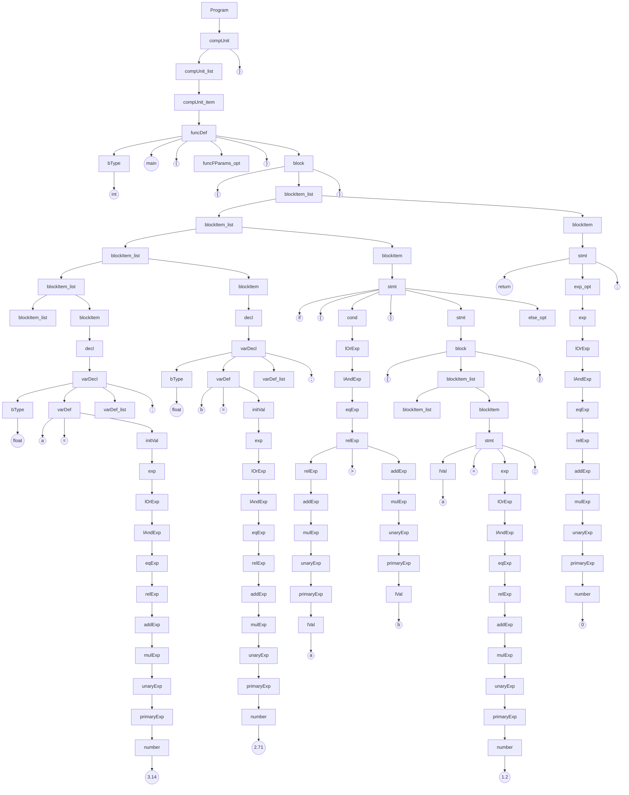

```mermaid
flowchart TD
    N0[Program]
    N1[compUnit]
    N0 --> N1
    N2[compUnit_list]
    N1 --> N2
    N3[compUnit_item]
    N2 --> N3
    N4[funcDef]
    N3 --> N4
    N5[bType]
    N4 --> N5
    N6(("int"))
    N5 --> N6
    N7(("main"))
    N4 --> N7
    N8(("("))
    N4 --> N8
    N9[funcFParams_opt]
    N4 --> N9
    N10((")"))
    N4 --> N10
    N11[block]
    N4 --> N11
    N12(("{"))
    N11 --> N12
    N13[blockItem_list]
    N11 --> N13
    N14[blockItem_list]
    N13 --> N14
    N15[blockItem_list]
    N14 --> N15
    N16[blockItem_list]
    N15 --> N16
    N17[blockItem_list]
    N16 --> N17
    N18[blockItem]
    N16 --> N18
    N19[decl]
    N18 --> N19
    N20[varDecl]
    N19 --> N20
    N21[bType]
    N20 --> N21
    N22(("float"))
    N21 --> N22
    N23[varDef]
    N20 --> N23
    N24(("a"))
    N23 --> N24
    N25(("="))
    N23 --> N25
    N26[initVal]
    N23 --> N26
    N27[exp]
    N26 --> N27
    N28[lOrExp]
    N27 --> N28
    N29[lAndExp]
    N28 --> N29
    N30[eqExp]
    N29 --> N30
    N31[relExp]
    N30 --> N31
    N32[addExp]
    N31 --> N32
    N33[mulExp]
    N32 --> N33
    N34[unaryExp]
    N33 --> N34
    N35[primaryExp]
    N34 --> N35
    N36[number]
    N35 --> N36
    N37(("3.14"))
    N36 --> N37
    N38[varDef_list]
    N20 --> N38
    N39((";"))
    N20 --> N39
    N40[blockItem]
    N15 --> N40
    N41[decl]
    N40 --> N41
    N42[varDecl]
    N41 --> N42
    N43[bType]
    N42 --> N43
    N44(("float"))
    N43 --> N44
    N45[varDef]
    N42 --> N45
    N46(("b"))
    N45 --> N46
    N47(("="))
    N45 --> N47
    N48[initVal]
    N45 --> N48
    N49[exp]
    N48 --> N49
    N50[lOrExp]
    N49 --> N50
    N51[lAndExp]
    N50 --> N51
    N52[eqExp]
    N51 --> N52
    N53[relExp]
    N52 --> N53
    N54[addExp]
    N53 --> N54
    N55[mulExp]
    N54 --> N55
    N56[unaryExp]
    N55 --> N56
    N57[primaryExp]
    N56 --> N57
    N58[number]
    N57 --> N58
    N59(("2.71"))
    N58 --> N59
    N60[varDef_list]
    N42 --> N60
    N61((";"))
    N42 --> N61
    N62[blockItem]
    N14 --> N62
    N63[stmt]
    N62 --> N63
    N64(("if"))
    N63 --> N64
    N65(("("))
    N63 --> N65
    N66[cond]
    N63 --> N66
    N67[lOrExp]
    N66 --> N67
    N68[lAndExp]
    N67 --> N68
    N69[eqExp]
    N68 --> N69
    N70[relExp]
    N69 --> N70
    N71[relExp]
    N70 --> N71
    N72[addExp]
    N71 --> N72
    N73[mulExp]
    N72 --> N73
    N74[unaryExp]
    N73 --> N74
    N75[primaryExp]
    N74 --> N75
    N76[lVal]
    N75 --> N76
    N77(("a"))
    N76 --> N77
    N78((">"))
    N70 --> N78
    N79[addExp]
    N70 --> N79
    N80[mulExp]
    N79 --> N80
    N81[unaryExp]
    N80 --> N81
    N82[primaryExp]
    N81 --> N82
    N83[lVal]
    N82 --> N83
    N84(("b"))
    N83 --> N84
    N85((")"))
    N63 --> N85
    N86[stmt]
    N63 --> N86
    N87[block]
    N86 --> N87
    N88(("{"))
    N87 --> N88
    N89[blockItem_list]
    N87 --> N89
    N90[blockItem_list]
    N89 --> N90
    N91[blockItem]
    N89 --> N91
    N92[stmt]
    N91 --> N92
    N93[lVal]
    N92 --> N93
    N94(("a"))
    N93 --> N94
    N95(("="))
    N92 --> N95
    N96[exp]
    N92 --> N96
    N97[lOrExp]
    N96 --> N97
    N98[lAndExp]
    N97 --> N98
    N99[eqExp]
    N98 --> N99
    N100[relExp]
    N99 --> N100
    N101[addExp]
    N100 --> N101
    N102[mulExp]
    N101 --> N102
    N103[unaryExp]
    N102 --> N103
    N104[primaryExp]
    N103 --> N104
    N105[number]
    N104 --> N105
    N106(("1.2"))
    N105 --> N106
    N107((";"))
    N92 --> N107
    N108(("}"))
    N87 --> N108
    N109[else_opt]
    N63 --> N109
    N110[blockItem]
    N13 --> N110
    N111[stmt]
    N110 --> N111
    N112(("return"))
    N111 --> N112
    N113[exp_opt]
    N111 --> N113
    N114[exp]
    N113 --> N114
    N115[lOrExp]
    N114 --> N115
    N116[lAndExp]
    N115 --> N116
    N117[eqExp]
    N116 --> N117
    N118[relExp]
    N117 --> N118
    N119[addExp]
    N118 --> N119
    N120[mulExp]
    N119 --> N120
    N121[unaryExp]
    N120 --> N121
    N122[primaryExp]
    N121 --> N122
    N123[number]
    N122 --> N123
    N124(("0"))
    N123 --> N124
    N125((";"))
    N111 --> N125
    N126(("}"))
    N11 --> N126
    N127(("}"))
    N1 --> N127
```
